# Lab - Power BI Project (PBIP) fundamentals

⏱️ Duration: 120 minutes

Welcome to this lab where you'll get hands-on experience with the **Power BI Project (PBIP)** format. This workshop is designed to help you understand the PBIP folder structure, set up Git source control, publish to a workspace, and work with **TMDL** and **PBIR** files.

## 🛠️ Prerequisites

* Enable the following **Power BI Desktop** preview features:
  * Power BI Project (.pbip) save option
  * Store semantic model using TMDL format
  * Store reports using enhanced metadata format (PBIR)
    
    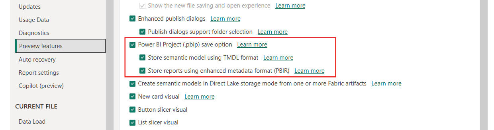

* Ensure you have the following software:    
  * [Visual Studio Code](https://code.visualstudio.com/download)  
  * [TMDL extension](https://marketplace.visualstudio.com/items?itemName=analysis-services.TMDL)
  * [Microsoft Fabric extension](https://marketplace.visualstudio.com/items?itemName=fabric.vscode-fabric)
  * [Python extension](https://marketplace.visualstudio.com/items?itemName=ms-python.python)
  * [Git for Windows](https://gitforwindows.org/)  
  * [Python 3.13](https://www.python.org/downloads/release/python-31312/)

## 1. Save a PBIX to PBIP Format

✅ **Goal**: Save your report as a PBIP project.

1. Open [resources/Sales.pbix](resources/Sales.pbix) in **Power BI Desktop**.
   
> [!IMPORTANT]
> * This PBIX file uses mock data sourced from CSV files hosted in a public location. When prompted for authentication, select **Anonymous** - the data should refresh without any errors.

2. Go to **File > Save As**.
3. Choose a folder (e.g. `c:\temp\lab1`) and select **Save as type**: `Power BI Project Files (*.pbip)`
4. Name it: `Sales.pbip`
5. **Power BI Desktop** now saves your work as a PBIP folder instead of a single PBIX file.
6. You can recognize a Power BI Project by the **expanded title bar** in Desktop, which allows you to identify and open the associated folder directly in Windows Explorer.

    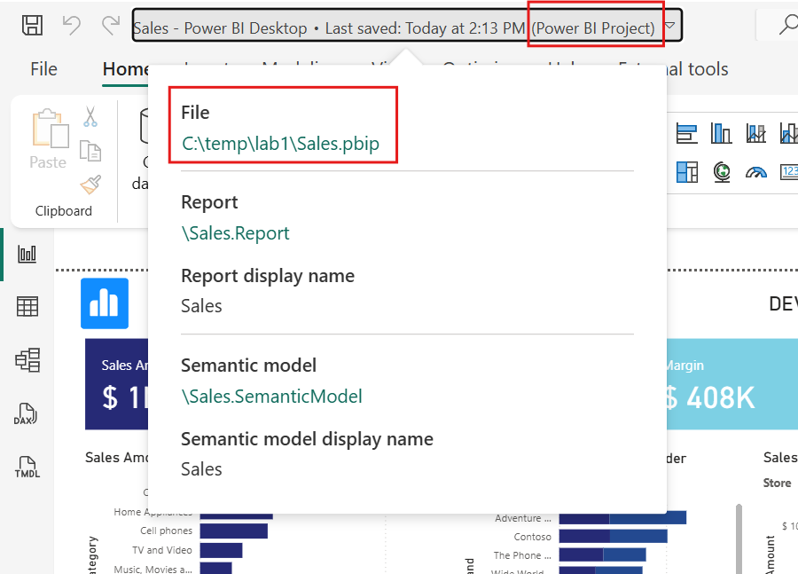
7. Although **Power BI Desktop** presents the experience as if you're working with a single file, you're actually editing two distinct components: the report and the semantic model, each stored in its own folder within the PBIP structure.
   
    ```text
    Lab1/
    ├── Sales.Report/
    ├── Sales.SemanticModel/
    ├── .gitignore
    └── Sales.pbip
    ```

## 2. Explore PBIP files and folders

✅ **Goal**: Understand how Power BI Project is organized and its key files and folders.

1. Open **Visual Studio Code**
1. Go to **File > Open Folder...** and open the saved PBIP folder.
1. Open and explore the following key files and folders:
   
    | File/Folder                            | Description |
    |----------------------------------------|-------------|
    | `*.pbip`                               | Main entry point file for **Power BI Desktop**. Includes a reference to the Report folder. **Optional** file; **Power BI Desktop** can also open a report by opening the `definition.pbir`. |
    | `*.Report/definition.pbir`             | Contains the overall report definition and key configuration settings such as folder version. Includes a reference to the **semantic model** — typically via a **relative byPath reference**, but can also use an **absolute byConnection reference** to connect to a model hosted in Fabric. |
    | `*.Report/definition`                  | Contains the report definition in [**PBIR format**](https://learn.microsoft.com/en-us/power-bi/developer/projects/projects-report?tabs=v2%2Cdesktop#pbir-format), where each report object (pages, visuals, bookmarks, etc.) is organized into its own **folders** and **JSON files**. |
    | `*.SemanticModel/definition`           | Contains the semantic model definition in [**TMDL file format**](https://learn.microsoft.com/en-us/power-bi/developer/projects/projects-dataset#tmdl-format), where each semantic model object (tables, roles, cultures, etc.) is organized into its own **folders** and **TMDL documents** using the [**TMDL language**](https://learn.microsoft.com/en-us/analysis-services/tmdl/tmdl-overview?view=sql-analysis-services-2025). |
    | `*.SemanticModel/.platform`           | Fabric platform file for the semantic model. Contains properties such as `displayName`, `description`, and `logicalId` (required for deployment and Fabric Git integration). |
    | `*.Report/.platform`                  | Same as the semantic model `.platform` file, but the `displayName` property is also used to define the **Power BI Desktop** window title. |
    | `*.SemanticModel/.pbi/cache.abf`      | A **local cached copy** of the semantic model's data stored as an Analysis Services Backup File (ABF). Acts as a **user-specific cache** and **should not be shared** via Git. **Power BI Desktop** can open the PBIP without it, but the model will be empty, requiring a data refresh. You can safely drop this file whenever you wish to share your development without compromising the data in it.|
1. Each file includes a `$schema` property at the top of the JSON document, which specifies the document's version. This property also helps clarify the meaning of other properties and can assist in detecting syntax errors when editing the files manually.

    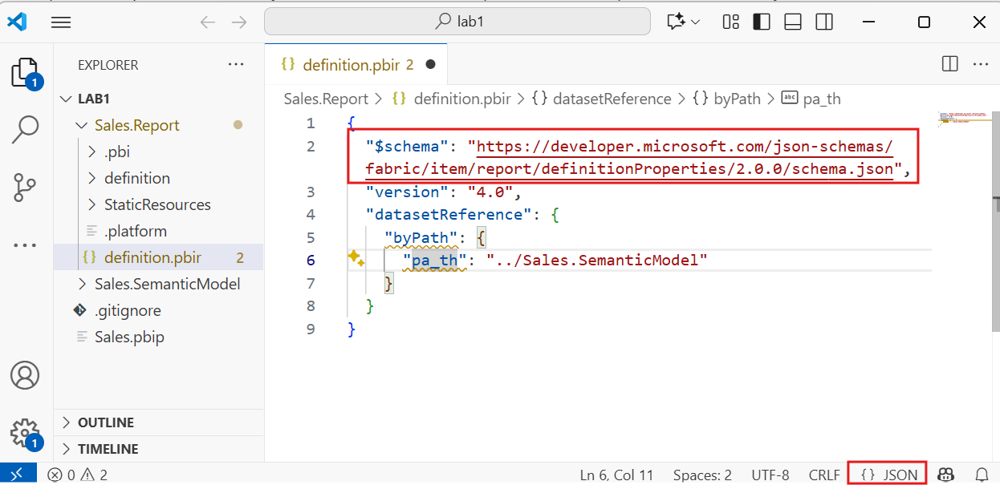

    Learn more about PBIP JSON schemas in the [documentation](https://learn.microsoft.com/en-us/power-bi/developer/projects/projects-overview#json-file-schemas).

> [!TIP]
> * Simply being able to explore PBIP files using a file explorer or code editor is a significant advantage. For example, you no longer need to wait minutes for **Power BI Desktop** to open a PBIX just to review a measure's DAX code or to confirm which database your semantic model is connected to by inspecting a table's Power Query code - Just open the files and look at the code!
> * All files and folders are documented in [PBIP documentation](https://learn.microsoft.com/en-us/power-bi/developer/projects/projects-overview) including references to their public [JSON-schemas](https://github.com/microsoft/json-schemas/tree/main/fabric). 
  

## 3. Version Control your PBIP

✅ **Goal**: Set up Git, initialize a repository for your PBIP project, track changes, commit, view history, and restore to a previous version.

### First time using Git in machine? (skip if you already use Git)

> [!IMPORTANT]
> * You only need to do this once!
> * It is important that these settings are in place before you start using git.

1. Open a new command prompt or terminal and run `git --version` to check that Git is installed:

    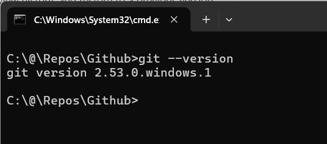

2. All git commits are tagged with your name and email as an identifier. Check the current settings:

    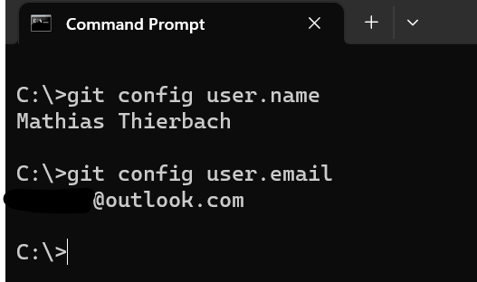

    If no values are returned or you want to change them, run:

    ```bash
    git config --global user.name "Your Name"
    git config --global user.email "your@email.com"
    ```

### Initialize local Git Repo for the PBIP folder

1. Open **Visual Studio Code** and go to **File > Open Folder...** to open the PBIP folder you saved in Exercise 1.
1. Navigate to the **Source Control** tab and click **Initialize Repository** button:

    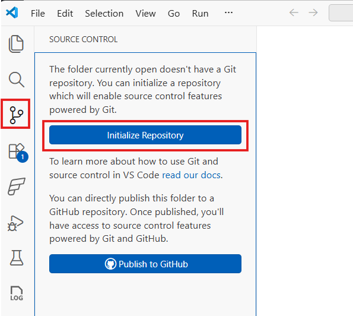

    The Source Control panel now shows untracked changes across a number of files:

    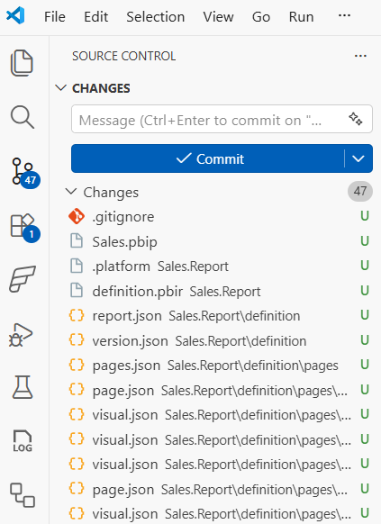

> [!IMPORTANT]
> Once you initialize a Git repository, a `.git/` folder is created you can view in file explorer. Do not edit, modify, or delete any files inside the `.git` directory.

### First commit

1. Provide a descriptive commit message (for instance, "Initial PBIP project") and click **Commit**. Confirm the dialog with **Yes** to stage and commit all changes.

    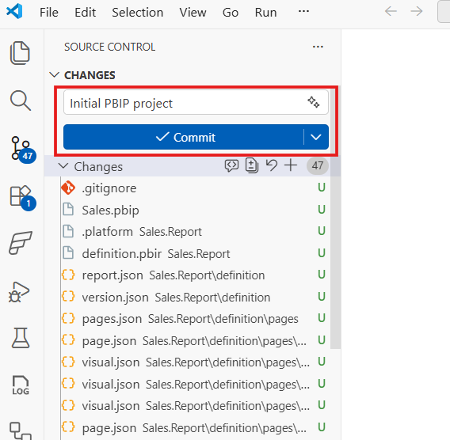

1. Once committed, the Source Control panel clears and shows no further pending changes. Also notice that the **Graph** tab shows your first commit.

    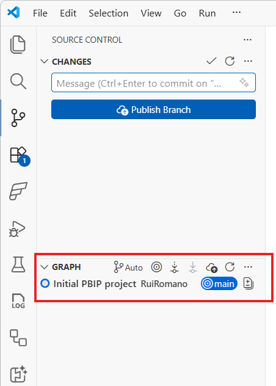

> [!TIP]
> It is a common mistake to forget the commit message. If that happens, **Visual Studio Code** will open a text file named `COMMIT_EDITMSG`. Simply close the COMMIT_EDITMSG tab and try again.
> 
> 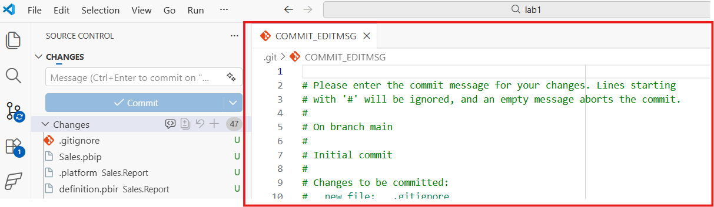


### Track your changes and Commit

1. Open `Sales.pbip` in **Power BI Desktop** (if not already opened).
1. Make a report change, for example move any visual to a different position
1. Make a semantic model change, for example edit any measure and add a comment `/// Change in Desktop`
1. **Save** in **Power BI Desktop**
1. Return to **Visual Studio Code** and open the **Source Control** tab. You'll see all the updated **PBIR** and **TMDL** files listed there, reflecting the changes you made in **Power BI Desktop**.
    
    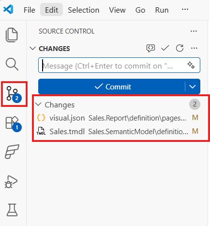

1. When you click on any of the files, a clear diff view opens so you can review exactly what was changed.

    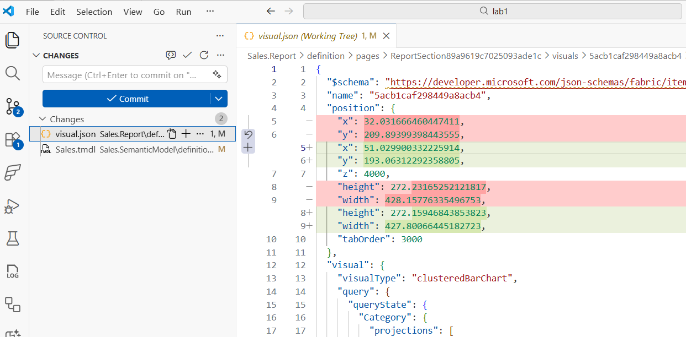

1. Provide a meaningful commit message describing what you changed (e.g., "Updated report layout") and click **Commit**.

    You can also use GitHub Copilot [**Generate Commit Message**](https://code.visualstudio.com/docs/sourcecontrol/overview#_stage-and-commit-changes) feature and use AI to to look into what changed and generate a commit message for you.

    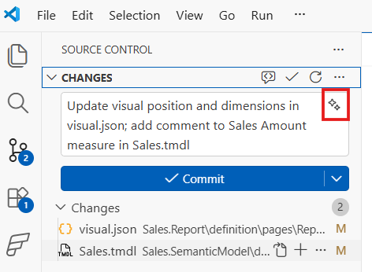

1. Notice that a new entry appears in the **Graph** tab. When you click on it, you can see the changes made to each file.

    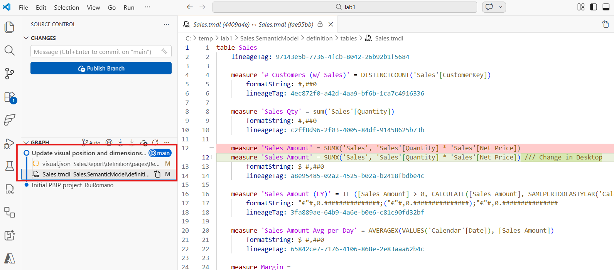
   
> [!TIP]
> It’s important to pause and reflect on this: using Git lets you see, in detail, exactly what Power BI changes in the underlying code files. Understanding this is key-because if you ever want to automate something in the future, you can simply perform the action in the UI and inspect the resulting changes to learn precisely what needs to be modified.

### Discard changes

1. Go back to **Power BI Desktop** and make some destructive changes, for example drop `Sales` page and drop table `Product`
1. **Save** in **Power BI Desktop**
1. Return to **Visual Studio Code** and open the **Source Control** tab. Notice all the code files that resulted from the destructive operation.
    
    
    
1. Normally if working against a PBIX if you make such a change and Save, it's not possible to recover. Specially if the change is on the semantic model. Not with PBIP, because you are using Git you can always discard these changes and it will go back to how it was before the change and perform a full roll back of the entire project to a previous state.
1. Click the **Discard All Changes** button in the Source Control panel to revert all uncommitted changes:

    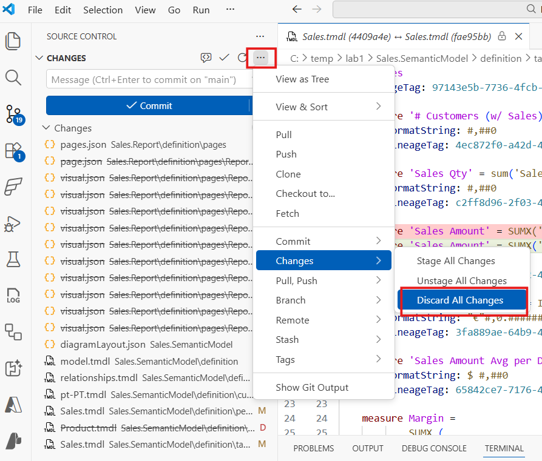

    Since this is a destructive action, **Visual Studio Code** requires an explicit confirmation:

    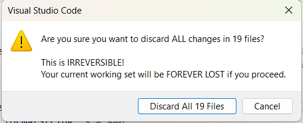

1. The destructive change you performed in the first step has now been undone - **but only in the PBIP code files, not in Power BI Desktop**. **Power BI Desktop** does not automatically detect changes made through external tools or direct file edits. To see the updated state reflected in the application, you need to **restart Power BI Desktop**.
1. Go back to **Power BI Desktop** and close the application **without saving**. If you choose to save, the destructive change will be written back to the code files, because that modification still exists in the current in-memory state of **Power BI Desktop**.
1. Re-Open `Sales.pbip` in **Power BI Desktop**
1. Notice that the destructive change has been reverted. If you deleted a semantic model table, its data is lost because Git does not track the `cache.abf` file. However, all of the table’s metadata is preserved, so you can always refresh the table to restore its data.

> [!IMPORTANT]
> With Git, you can much safely experiment with developments, knowing you can always recover your work if needed. It’s a best practice to commit often, with each commit representing a clear unit of work (e.g., creating or editing a measure). This approach not only helps you track changes but also makes it easy to roll back or recover specific developments.

### Restore to previous commit

1. One of the key benefits of using Git is the ability to switch between different versions of your development effortlessly—no need to maintain multiple PBIX files like `Report.pbix`, `Report-beforeNewMeasureX.pbix`, and so on. You can quickly navigate to the version of your project corresponding to a specific commit in your Git repository.
1. Let's go back to the initial version of your project before any changes. 
1. In **Source Control Graph** right-click the first commit and select **Create Branch...**
   
    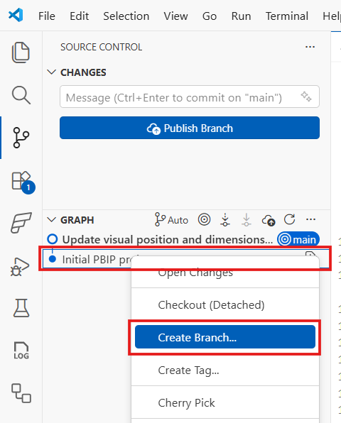

    Name your new branch something like "before changes":

    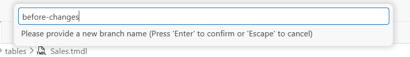

1. Notice that now your **Source Control Graph** don't track the changes you did before. Git branches work directly on your project folder: when you switch branches.
1. Close **Power BI Desktop** (without saving), then reopen `Sales.pbip` and observe that the Report and Semantic Model no longer include any of the previous changes.
1. Git replaces the files in your folder with the version stored in that branch, letting you work on different versions without mixing them. 
1. Switch back to the main branch and observe that all your changes have returned in the PBIP files.

    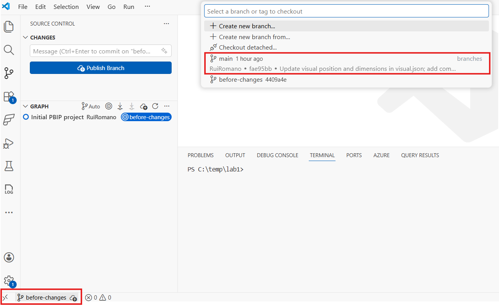

> [!TIP]
> - Git is an essential tool for Power BI developers working with PBIP files. It provides a safety net for experimenting, a clear audit trail of all changes, and the ability to collaborate with teammates. 
> - Git branches let you work on different versions of your project at the same time, and you can easily switch between them without affecting each other. For example, create a branch each time you start a new development giving you the ability to work in isolation and always come back to the original version very esily while keeping your development going in the original branch. Learn more about branches in [Git Branches and Worktrees in VS Code](https://code.visualstudio.com/docs/sourcecontrol/branches-worktrees)

## 4. Publish Power BI Project to workspace

✅ **Goal**: Publish your PBIP project to a Fabric workspace using both **Power BI Desktop** and the **Microsoft Fabric VS Code extension**, and understand the differences between them.

### Publish from Desktop

1. Create a new workspace in Fabric, give it a name like `Workshop - Lab 1`.
2. In **Power BI Desktop**, open your `Sales.pbip` if not already open.
3. Publish the report to the workspace using **Power BI Desktop** **Publish** option.
   
   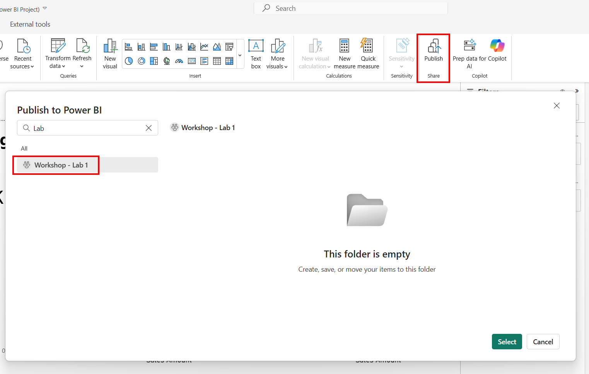

4. The workspace should now have a new report and semantic model inside.

### Publish from Fabric VS Code extension

1. Open **Visual Studio Code** and navigate to the **Microsoft Fabric extension**.
   
   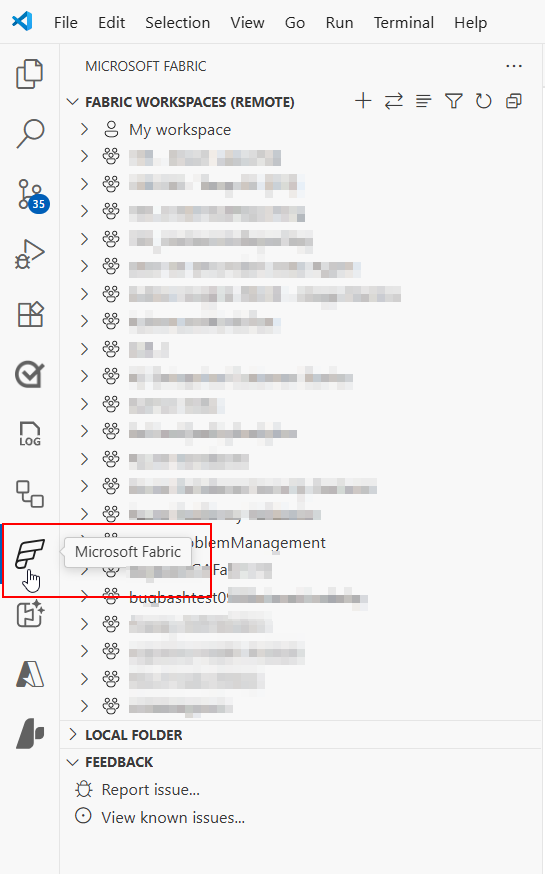

1. Filter the workshop workspace.
    
    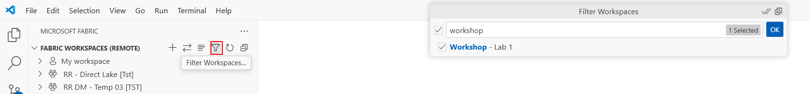

7. Go to **File > Open Folder...** and open the PBIP folder.
8. In the **Microsoft Fabric extension**, expand the **Local folder** node and confirm that each Report (*.Report) and SemanticModel (*.SemanticModel) folder from your PBIP folder is listed in the tree-view.
   
   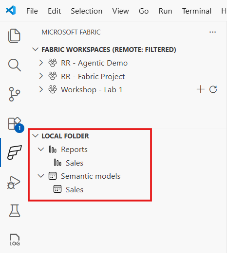

9. Right-click the `Sales` semantic model, select **Publish > To specific workspace...** and pick a Fabric workspace.
   
   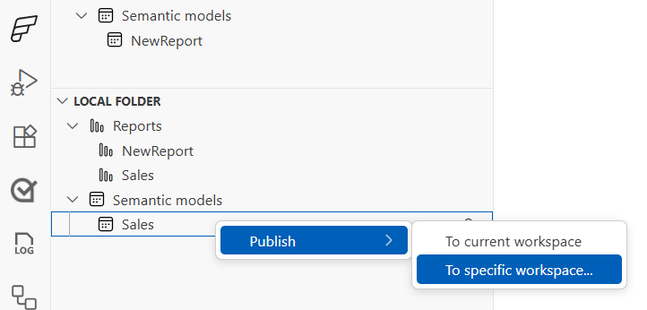
   
   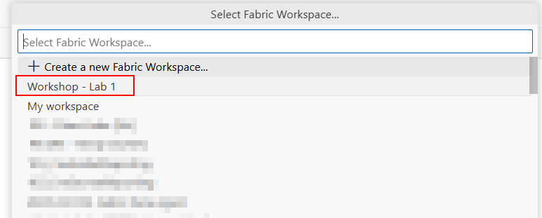

    Look for the operation status in the bottom right corner:

    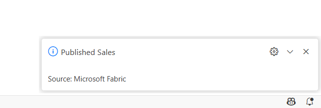

10. Confirm the semantic model got published to the workspace.
11. Repeat the publish operation for the Report. Unlike semantic models, Power BI reports must be connected to a semantic model. The **Fabric extension** will prompt you to select the target semantic model in the workspace that the report will connect to.

    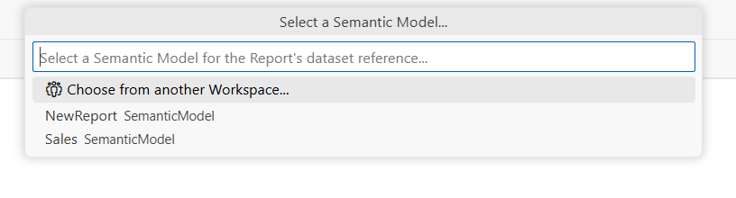

### Key differences between the two publish methods

|                         | **Power BI Desktop Publish**                                                                                     | **Fabric VS Code Extension Publish**                                                                                         |
| ----------------------- | ---------------------------------------------------------------------------------------------------------------- | ---------------------------------------------------------------------------------------------------------------------------- |
| **What gets published** | Everything — definitions + data                                                                                  | **Only definitions (metadata)** — no data is pushed                                                                          |
| **Granularity**         | Publishes the report and semantic model together                                                                 | Granular control — you choose to publish the report, the semantic model, or both independently                               |
| **API used**            | Traditional [PBIX publish API](https://learn.microsoft.com/en-us/rest/api/power-bi/imports/post-import-in-group) | [Fabric REST CRUD APIs](https://learn.microsoft.com/en-us/rest/api/fabric/core/items) |
| **Best for**            | Initial publish or when data needs to be pushed                                                                  | Iterative development — e.g. fixing a DAX measure without waiting for a full data refresh                                    |

> [!IMPORTANT]
> The **Fabric extension** approach significantly **boosts development efficiency**. For example, when making a simple update like fixing a DAX measure or updating a report page, you can publish only the code definition and skip the data entirely.

### Switch the semantic model of a PBIP report

All Power BI reports must connect to a semantic model. When using the PBIP file format, the semantic model that a report connects to is defined in the `definition.pbir` file. By default, the connection is relative (called `byPath`), but you can also configure a remote connection (called `byConnection`) to target a semantic model hosted in the service.

This exercise demonstrates how to configure a local Power BI report to connect either to a **local semantic model** running in **Power BI Desktop** or to a **remote semantic model** in a Fabric workspace by switching to **Live Connect** mode. 

> [!TIP]
> Using multiple `*.pbir` files is particularly useful for toggling between local and remote semantic models, providing flexibility for development, testing, and iterative report design. More details in [definition.pbir](https://learn.microsoft.com/en-us/power-bi/developer/projects/projects-report?tabs=v2%2Cdesktop#definitionpbir).


1. Open the workspace and grab the following attributes:
    * Workspace and semantic model name
  
        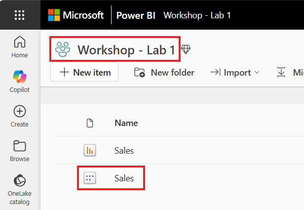
    
    * Semantic model ID
  
        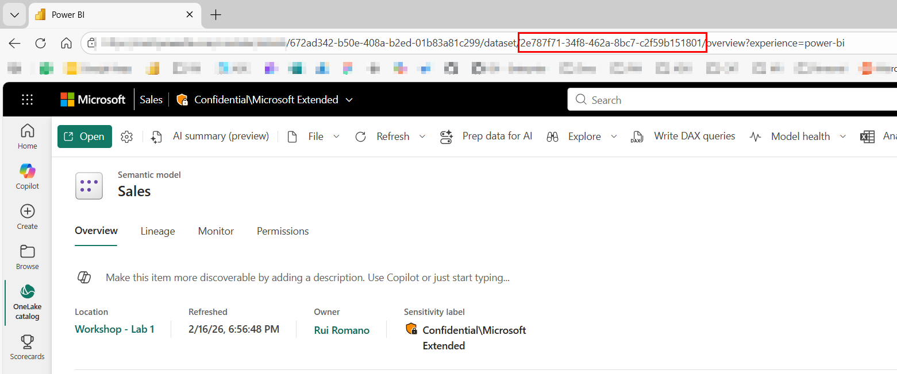

2.  Go back to **Visual Studio Code** and create a new file `definition-live.pbir` inside `Sales.Report/` folder with the following content:
   
    Replace the placeholders `[WorkspaceName]`, `[SemanticModelName]` and `[SemanticModelId]` with the attributes from the previous step.

    ```json
    {
        "$schema": "https://developer.microsoft.com/json-schemas/fabric/item/report/definitionProperties/2.0.0/schema.json",
        "version": "4.0",
        "datasetReference": {
            "byConnection": {      
                "connectionString": "Data Source=\"powerbi://api.powerbi.com/v1.0/myorg/[WorkspaceName]\";initial catalog=[SemanticModelName];access mode=readonly;integrated security=ClaimsToken;semanticmodelid=[SemanticModelId]"
            }
        }
    }
    ```

    The report folder should now include two `*.pbir` files side by side:

    ```text    
    Lab1/
    ├── Sales.Report/
    |   ├── definition/
    |   ├── definition-live.pbir
    |   └── definition.pbir
    ```
1. Open the `definition-live.pbir` with **Power BI Desktop** and notice that now the semantic model is not opened for edit but instead the report is **Live Connected** to the semantic model in the Fabric workspace.

    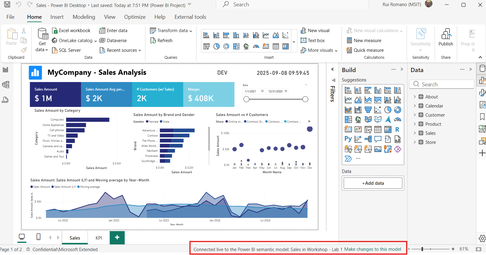

## 5. Semantic Modeling as Code with TMDL

✅ **Goal**: Edit a semantic model using TMDL, reuse shared TMDL components, and edit TMDL directly on a workspace using the Fabric extension.

### Edit semantic model using TMDL

1. Close **Power BI Desktop** and Open **Visual Studio Code**
1. Go to **File > Open Folder...** and open the PBIP folder.
1. Open file `Sales.SemanticModel/definition/tables/Sales.tmdl`
1. Notice the TMDL code readability features provided by TMDL extension:
   * **Code highlighting** - Easily identify different elements of TMDL code: types, values, expressions
    
        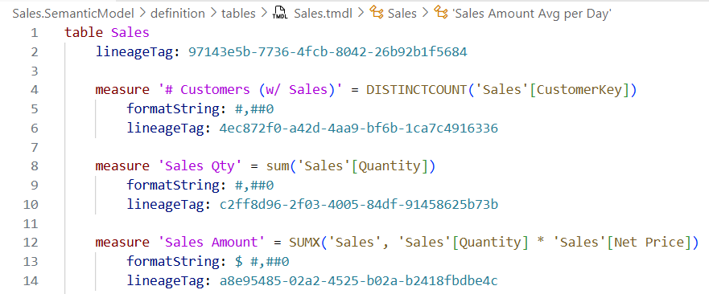

   *  **Breadcrumb navigation** - Easily navigate between TMDL files and objects
        
        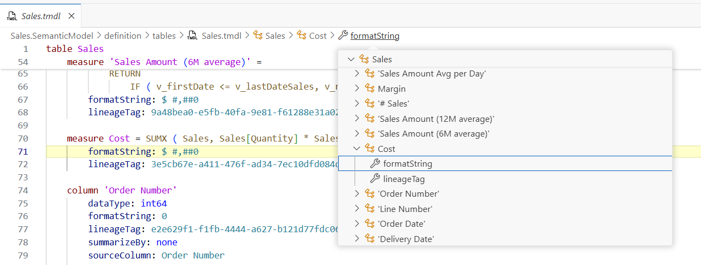

   * **Code formatting** - Keep your TMDL code clean and consistent
        
        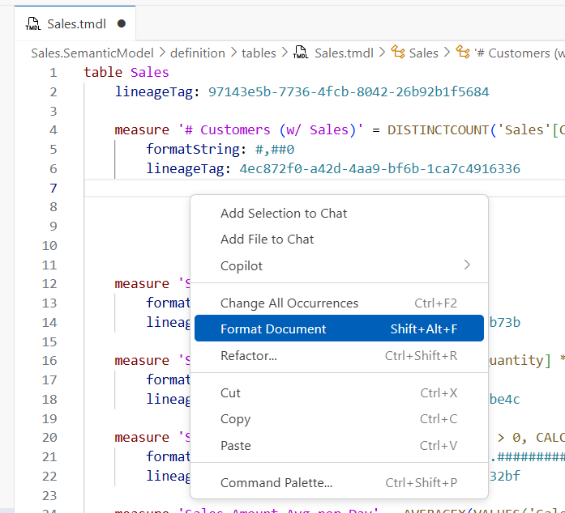

1. Create two new measures by duplicating the code of the measure `Sales Qty`. Select all the lines of the `Sales Qty` measure and press **SHIFT + ALT + Down arrow**
 
    The TMDL code should look like the following:

     ```TMDL
    table Sales
        ...
        measure 'Sales Qty' = sum('Sales'[Quantity])
            formatString: #,##0
            lineageTag: c2ff8d96-2f03-4005-84df-91458625b73b
        measure 'Sales Qty' = sum('Sales'[Quantity])
            formatString: #,##0
            lineageTag: c2ff8d96-2f03-4005-84df-91458625b73b
        measure 'Sales Qty' = sum('Sales'[Quantity])
            formatString: #,##0
            lineageTag: c2ff8d96-2f03-4005-84df-91458625b73b
        ...
     ```
1. Notice that the TMDL extension highlights errors with red squiggles. You can also view a list of problems in the Problems pane - go to **View > Problems**.

    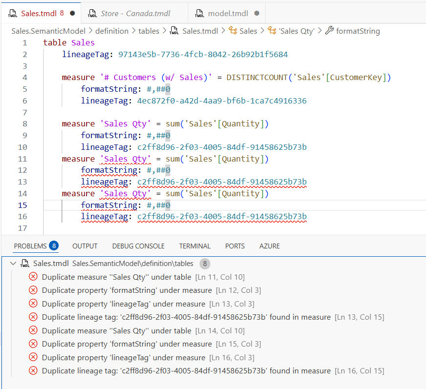
   
1. Rename the new measures to `Sales Qty (LY)` and `Sales Qty Avg per Day` and change the DAX expression accordingly.

    TMDL code should look like the following:

    ```TMDL
    table Sales
        ...
        measure 'Sales Qty' = sum('Sales'[Quantity])
            formatString: #,##0
            lineageTag: c2ff8d96-2f03-4005-84df-91458625b73b
        
        measure 'Sales Qty (LY)' = IF ([Sales Qty] > 0, CALCULATE([Sales Qty], SAMEPERIODLASTYEAR('Calendar'[Date])))
            formatString: #,##0
            lineageTag: c2ff8d96-2f03-4005-84df-91458625b73b
        
        measure 'Sales Qty Avg per Day' = AVERAGEX(VALUES('Calendar'[Date]), [Sales Qty])
            formatString: #,##0
            lineageTag: c2ff8d96-2f03-4005-84df-91458625b73b
        ...
     ```
1. The TMDL extension will highlight an error when a duplicate lineage tag is detected. Lineage tags must be unique within their scope — for example, two measures in the same table cannot share the same tag. Fix this by either entering a new unique identifier in the `lineageTag` property or using the TMDL extension's **code action** to generate a new lineage tag automatically.

    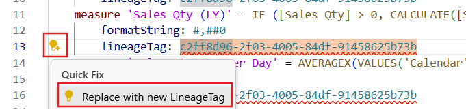

    Learn more about lineage tags in [lineage-tags-for-power-bi-semantic-models](https://learn.microsoft.com/en-us/analysis-services/tom/lineage-tags-for-power-bi-semantic-models).

1.  Configure the `displayFolder` property on the three Quantity measures. 
    
    You can edit multiple lines at same time, by using VS Code [multi cursor](https://code.visualstudio.com/docs/editing/codebasics#_multiple-selections-multicursor) feature. Press the **ALT** key and click at the end of line of the `lineageTag` property value of each measure.
    
    Notice the IntelliSense help while you type the property name:

    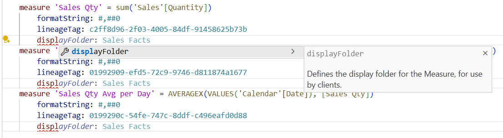

    TMDL code should look like the following (note: your lineage tags should be different):

    ```TMDL
    table Sales
        ...
        measure 'Sales Qty' = sum('Sales'[Quantity])
            formatString: #,##0
            lineageTag: c2ff8d96-2f03-4005-84df-91458625b73b
            displayFolder: Qty
        measure 'Sales Qty (LY)' = IF ([Sales Qty] > 0, CALCULATE([Sales Qty], SAMEPERIODLASTYEAR('Calendar'[Date])))
            formatString: #,##0
            lineageTag: 01992909-efd5-72c9-9746-d811874a1677
            displayFolder: Qty
        measure 'Sales Qty Avg per Day' = AVERAGEX(VALUES('Calendar'[Date]), [Sales Qty])
            formatString: #,##0
            lineageTag: 0199290c-54fe-747c-8ddf-c496eafd0d88
            displayFolder: Qty
        ...
     ```

1. Save the edited files in **Visual Studio Code** and open the `Sales.pbip` with **Power BI Desktop** to verify the newly created measures.

> [!TIP]
> While this example was simple, it demonstrates the potential of direct TMDL editing for large code changes or simple refactorings. You can take advantage of everything code editors offer, such as keyboard shortcuts, code duplication with copy & paste, advanced find-and-replace with regular expressions, programmatic edits, and more.

### Reuse semantic model objects using TMDL files

1. Close **Power BI Desktop**.
1. Copy the [`resources/tmdl/Time Intelligence.tmdl`](resources/tmdl/Time%20Intelligence.tmdl) TMDL file to the `Sales.SemanticModel\definition\tables` folder.
1. Open `Sales.pbip` in **Power BI Desktop** and verify that the semantic model now includes the new **Time Intelligence** calculation group table. A refresh may be required.
   
    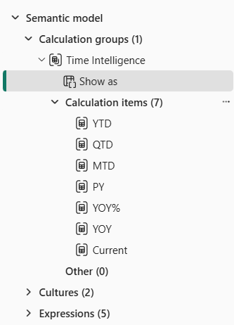
   
> [!TIP]
> The **TMDL folder structure makes it easy to reuse and collaborate while developing semantic models**. With TMDL you can maintain shared model components (e.g. calendar tables, calculation groups, roles,...) and quickly apply them to multiple semantic models by simply copy  files between semantic model code definitions.

### Edit TMDL using Fabric Extension

1. Open **Visual Studio Code** and navigate to the **Microsoft Fabric extension**.
1. In the workspace tree-view, expand the semantic model that was previously published to the workspace.  
   
   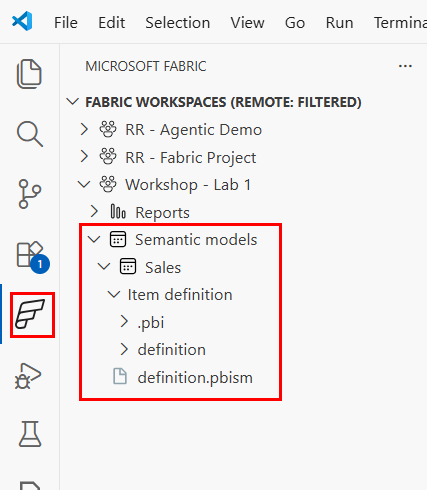

1. Navigate to the **definition** node of the semantic model - you should see the TMDL files representing the semantic model code definition directly from the workspace.
   
    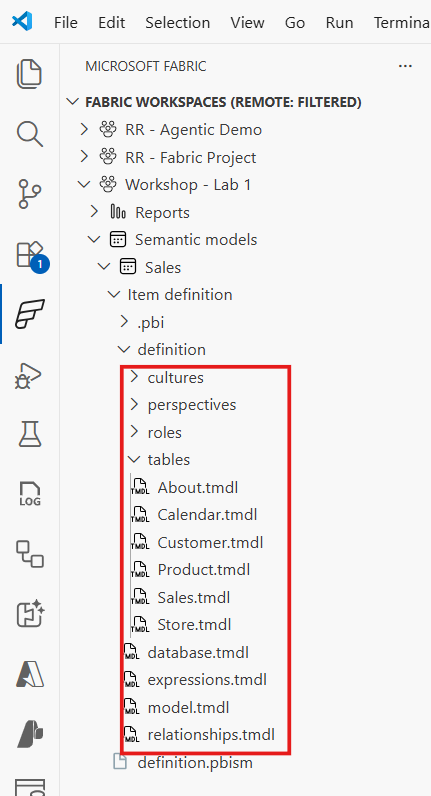

1. Open the `definition/tables/Sales.tmdl` file and click select to edit the file
   
    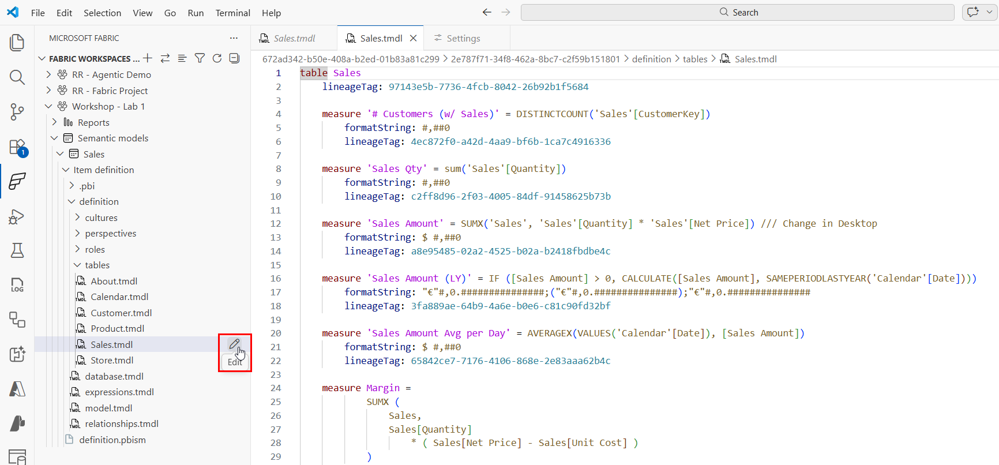

    You may need to enable the [**Edit Item Definitions**](vscode://settings/Fabric.EditItemDefinitions) setting in the extension.

1. Make a small edit — for example, create a new measure.
1. **Save** the file. The **Fabric extension** will push the updated definition directly to the workspace.  

    Notice the notification banner in the bottom-right:

    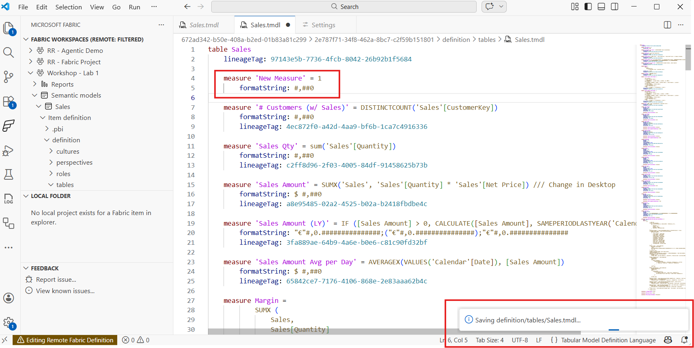

1. Confirm the change got applied to the semantic model in the workspace

    You can open the item from **Visual Studio Code** by right-click the item and select **Open in Fabric...**

    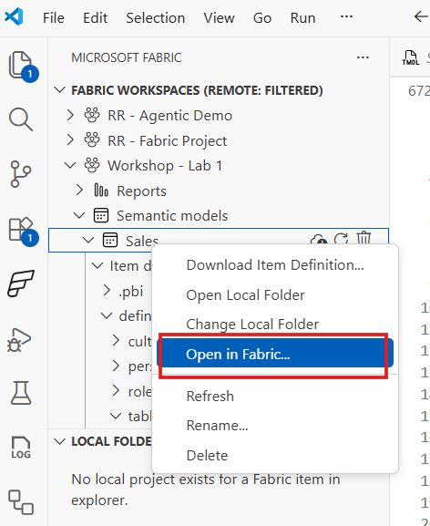

> [!TIP]
> Editing TMDL through the **Fabric extension** allows you to make quick, targeted changes to a semantic model in a workspace **without needing Power BI Desktop or a local PBIP copy**. This is especially useful for hotfixes or quick adjustments in development/test workspaces.

## 6. Report as Code with PBIR

✅ **Goal**: Map a report object to a PBIR file, identify changes, batch apply changes using a script, and edit PBIR directly on a workspace using the Fabric extension.

### Edit Report using PBIR

1. Open `Sales.pbip` with **Power BI Desktop**.
1. Go to **File > Options and settings > Options > Report settings** and enable **Copy object names when right clicking on report objects**.
   
   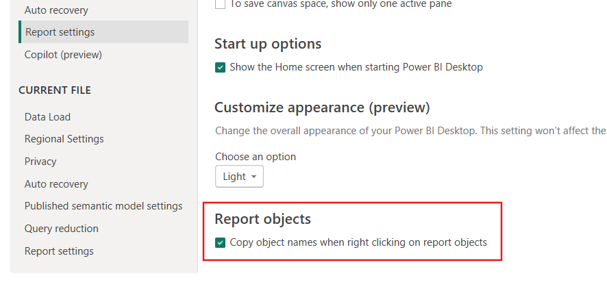

1. In the `Sales` page, hide the title from the first bar chart.
   
   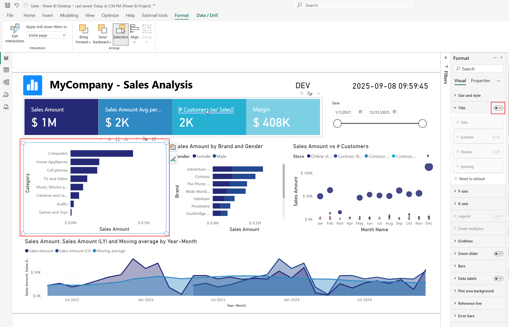

1. Open the **More options** menu in the top-right corner and select **Copy object name**
   
   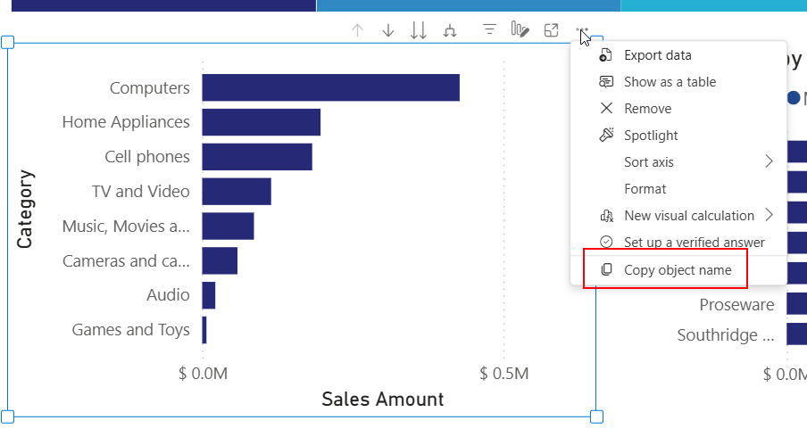

1. Save the PBIP.
1. Open **Visual Studio Code**
1. Go to **File > Open Folder...** and open the PBIP folder.
1. Right-click the `Sales.Report` folder, select **Find in folder** and paste the report object name.
   
   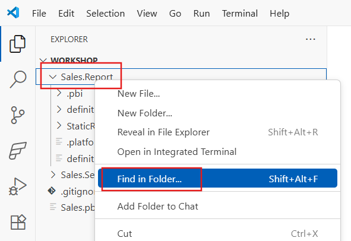

   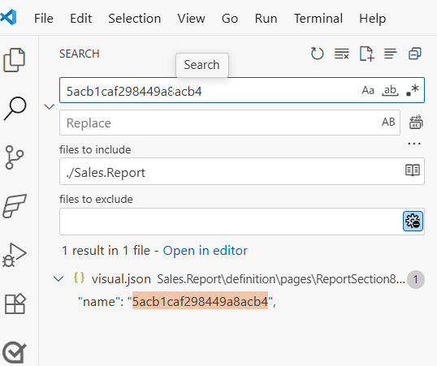
   
1. Open the matched file for edit.
1. Mouse-hover the `height` property and notice that **Visual Studio Code** shows a tooltip that explains the property.

    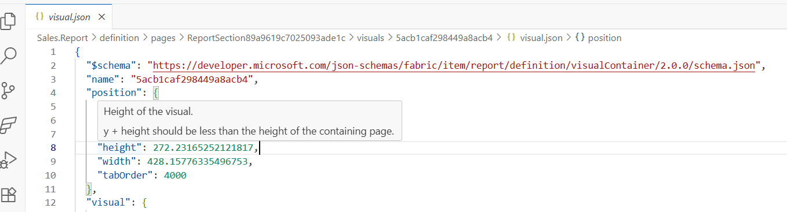

    This is because PBIR JSON files include a JSON schema declaration at the top of the document with the `$schema` property. Additionally, it provides built-in IntelliSense and validation when editing with code editors like Visual Studio Code.

    If you misspell a property name, the code editor will flag the error and show an explanatory tooltip or entry in the Problems pane:

    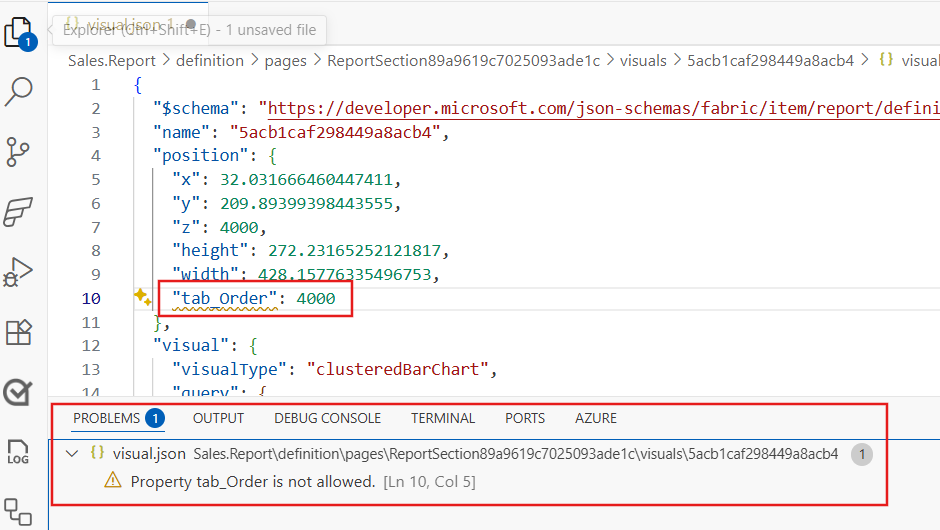

    Learn more about PBIR schemas in [documentation](https://learn.microsoft.com/en-us/power-bi/developer/projects/projects-report?tabs=v2%2Cdesktop#pbir-json-schemas).

1. Navigate to the JSON property `visual.visualContainerObjects.title` and notice that the property `show` is configured as `false`. This is the configuration that determines that the visual title is hidden.

    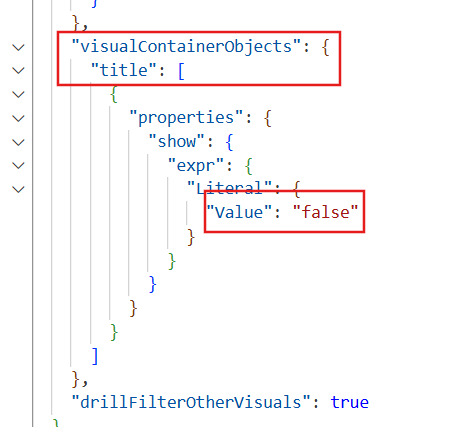

### Edit with script

Now that you know which property to modify in the PBIR JSON, let’s update it in bulk using a script.

1. Close **Power BI Desktop**
1. Create a new **PowerShell** script file named `HideVisualTitles.ps1` side by side with the `Sales.pbip`.

    ```text
    Lab1/
    ├── Sales.Report/
    ├── Sales.SemanticModel/    
    ├── HideVisualTitles.py
    └── Sales.pbip
    ```

    Copy and paste the following PowerShell code to `HideVisualTitles.py`
    
    ```python
    import json
    import os
    from pathlib import Path


    def main():
        current_path = Path(os.path.dirname(os.path.abspath(__file__)))
        report_path = current_path / "Sales.Report"

        visual_files = list(report_path.rglob("visual.json"))

        for file in visual_files:
            print(f"Processing visual in file: {file}")

            with open(file, "r", encoding="utf-8") as f:
                data = json.load(f)

            visual = data.get("visual", {})

            # Ensure the nested structure exists
            if "visualContainerObjects" not in visual:
                visual["visualContainerObjects"] = {}

            container_objects = visual["visualContainerObjects"]

            if "title" not in container_objects:
                container_objects["title"] = [{"properties": {}}]

            title = container_objects["title"]

            # title can be a list (array) — access the first element
            if isinstance(title, list):
                title_obj = title[0]
            else:
                title_obj = title

            if "properties" not in title_obj:
                title_obj["properties"] = {}

            properties = title_obj["properties"]

            if "show" not in properties:
                properties["show"] = {
                    "expr": {
                        "Literal": {
                            "Value": "false"
                        }
                    }
                }
            else:
                properties["show"]["expr"]["Literal"]["Value"] = "false"

            with open(file, "w", encoding="utf-8") as f:
                json.dump(data, f, indent=2, ensure_ascii=False)
                f.write("\n")


    if __name__ == "__main__":
        main()

    ```
1. Click **Run** in the top-right to run the **Python** script

    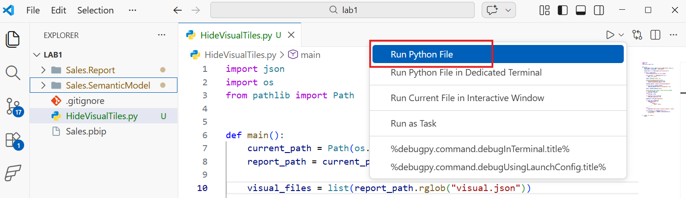

    The following output is expected:

    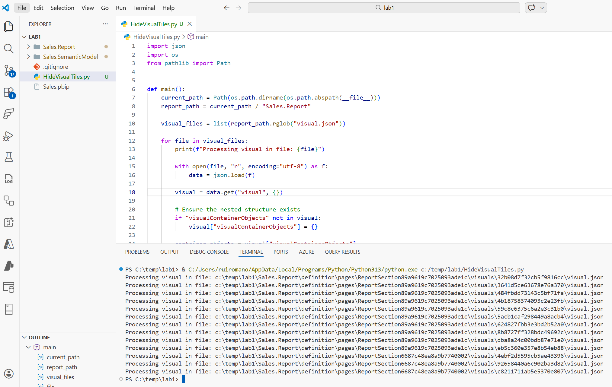

1. Open the `Sales.pbip` with **Power BI Desktop** and notice that all visuals in all pages got the title hidden.

    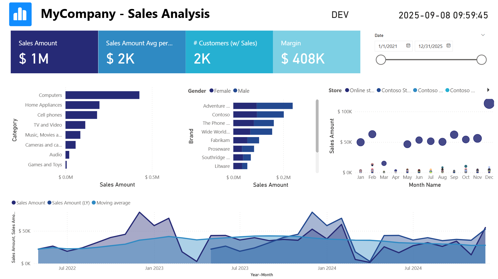

> [!IMPORTANT]
> This example is simple and educational - it could have been more efficient to hide titles using multi-select on each page. However, if you needed to apply the same change across 50 reports with an average of 10 pages each, automating it with a script like the one above and running it against all PBIR report files would be far more efficient.

### Edit PBIR using Fabric Extension

1. Open **Visual Studio Code** and navigate to the **Microsoft Fabric extension**.
1. In the workspace tree-view, expand the report that was previously published to the workspace.
1. Navigate to the **definition** node of the report - you should see the PBIR JSON files representing the report's pages and visuals directly from the workspace.
   
   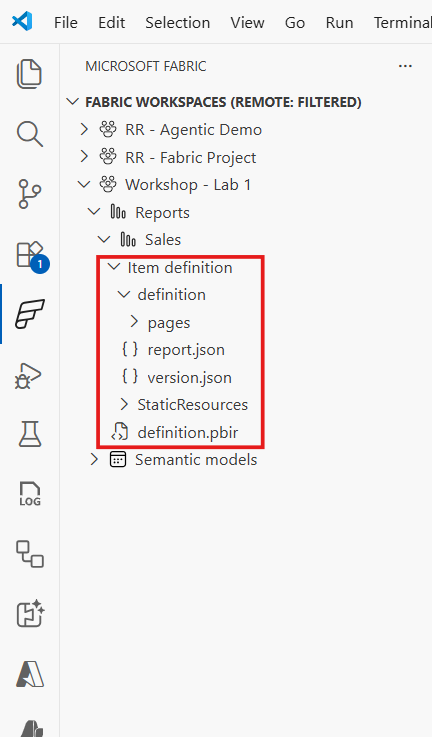

1. Open the visual.json of the report title, it should be `definition\pages\ReportSection89a9619c7025093ade1c\visuals\eb5c360e357e8b54eb88\visual.json`, enable file edit and update the title.
   
   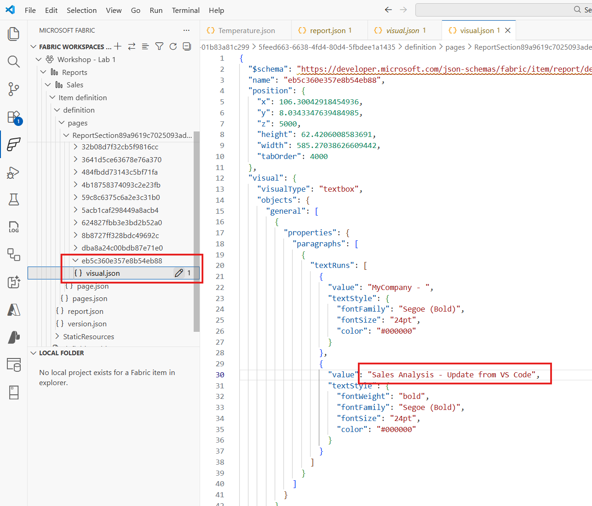

    You may need to enable the [**Edit Item Definitions**](vscode://settings/Fabric.EditItemDefinitions) setting in the extension.

1.  Save the file. The **Fabric extension** will push the updated definition directly to the workspace.
1.  Open the report in the Fabric workspace to confirm the changes are reflected.
   
   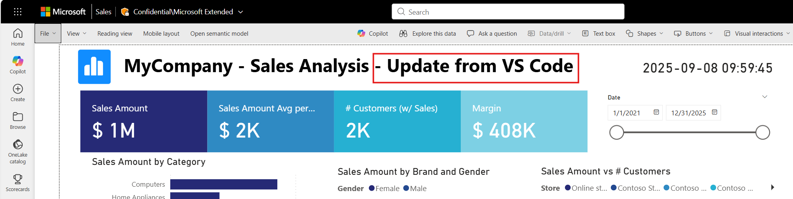
   
> [!TIP]
> Editing PBIR through the **Fabric extension** allows you to make quick, targeted changes to a report in a workspace **without needing Power BI Desktop or a local PBIP copy**. Combined with TMDL editing, this means you can make end-to-end changes to both semantic models and reports directly in a workspace from **Visual Studio Code**.

## ✅ Wrap-up

You've now:

* Understood PBIP files and its folder structure.
* Set up Git source control, tracked changes, committed, and restored to a previous version.
* Published from both **Power BI Desktop** and **Fabric VS Code extension**, understanding the key differences.
* Connected a report to a remote semantic model using multiple `definition.pbir` files.
* Edited and reused TMDL files for semantic model development.
* Edited PBIR files, mapped report objects to PBIR files and batch-changed a report using a script.
* Edited TMDL and PBIR files directly on a workspace using the **Fabric extension**.

## Useful links

* [Power BI Project docs](https://learn.microsoft.com/en-us/power-bi/developer/projects/projects-overview)
* [TMDL language docs](https://learn.microsoft.com/en-us/analysis-services/tmdl/tmdl-overview?view=sql-analysis-services-2025)
* [Visual Studio Code basics](https://code.visualstudio.com/docs/introvideos/basics)
* [Introduction to Git in Visual Studio Code](https://code.visualstudio.com/docs/sourcecontrol/overview)
* [Git Will Finally Make Sense After This](https://www.youtube.com/watch?si=h_hAniLBVfO05X7A&v=Ala6PHlYjmw&feature=youtu.be)
* [Microsoft Fabric extension for VS Code](https://marketplace.visualstudio.com/items?itemName=fabric.vscode-fabric)
