# Lab - Power BI and CI/CD

In this lab you will set up a complete CI/CD pipeline for a Power BI project. Starting from a pre-configured repository template, you will configure automated deployments using GitHub Actions, enforce quality gates with the Best Practice Analyzer, and practice the Pull Request workflow that ties it all together.

## Goals

- Set up a working repository from a template and configure deployment credentials
- Understand `fabric-cicd` as the recommended deployment tool for PBIP projects
- Automate deployments via GitHub Actions on every push to `main`
- Use the Best Practice Analyzer (BPA) to enforce quality standards on Pull Requests
- Experience a complete Pull Request workflow with automated BPA quality gates

## 0. Setup

**Goal**: Create your own copy of the lab repository on GitHub and prepare the deployment credentials.

### Create a new GitHub repository from the template

1. Navigate to the template repository: **<https://github.com/RuiRomano/workshops-cicd-demo>**

2. Click the green **Use this template** button, then select **Create a new repository**.

    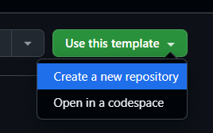

3. Choose an **Owner**, give your repository a **name** (for example, `workshop-cicd`), and select the desired **visibility** (Public or Private). Then click **Create repository**.

    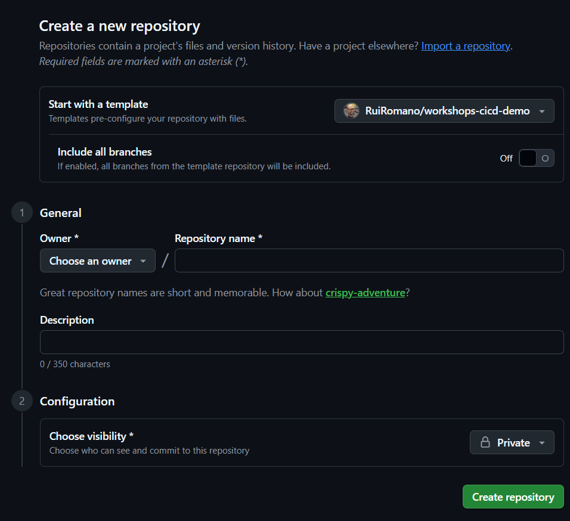

> [!TIP]
> Creating a repository from a template gives you a clean copy with the full directory structure and all files, but without the template's commit history. Learn more in the [GitHub docs on template repositories](https://docs.github.com/en/repositories/creating-and-managing-repositories/creating-a-repository-from-a-template).

### Prepare the AZURE_CREDENTIALS secret

Automated deployments via GitHub Actions require a **service principal** — an identity in Microsoft Entra ID (formerly Azure AD) that represents an application rather than a human user. Your workshop environment should already have a service principal provisioned for you.

> [!IMPORTANT]
> If a service principal has **not** been set up yet, follow the step-by-step instructions in **[Appendix A: Service Principal Setup](appendix-a-service-principal-setup.md)** before continuing.

Using your service principal's details, prepare the following JSON — you will need it in Section 2 when configuring GitHub Actions:

```json
{
  "clientId": "<Application (client) ID>",
  "clientSecret": "<Client secret value>",
  "tenantId": "<Directory (tenant) ID>"
}
```

> [!TIP]
> Keep this JSON in a temporary text file or clipboard manager — you will paste it into GitHub shortly.

### Explore the repository structure

Take a moment to browse the files in your newly created repository on GitHub. The template is organized like this:

```text
your-repo/
├── src/                              ← Power BI project files (PBIP)
│   ├── Sales.Report/
│   ├── Sales.SemanticModel/
│   ├── AnotherReport.Report/
│   ├── Sales.pbip
│   └── parameter.yml                 ← environment parameterization
├── scripts/
│   ├── deploy.py                     ← deployment script
│   ├── deploy.config                 ← workspace name configuration (for CI/CD)
│   └── bpa/                          ← BPA scripts and rule files
│       ├── bpa.ps1
│       ├── bpa-rules-semanticmodel.json
│       └── bpa-rules-report.json
├── .github/
│   └── workflows/
│       ├── deploy.yml                ← deployment workflow
│       └── bpa.yml                   ← quality checks workflow
├── requirements.txt                  ← Python dependencies
└── .gitignore
```

All scripts and workflows are already in place — you will **not** need to create any of these files.

## 1. Introduction to fabric-cicd

How does source code in a GitHub repository actually get deployed to a Fabric workspace? The answer is [`fabric-cicd`](https://microsoft.github.io/fabric-cicd/latest/) — a Python library developed by Microsoft that is the recommended tool for deploying Fabric items from source control.

`fabric-cicd` takes the PBIP definition files in your repository and publishes them to a target workspace via the Fabric REST APIs. Rather than calling APIs directly, you write a short Python script that configures `fabric-cicd` and lets the library handle the heavy lifting — API calls, retries, status polling, and error handling.

A key design principle is that **the same script works identically on your local machine and inside a GitHub Actions workflow**. This means you can test deployments locally first and reproduce CI/CD failures on your workstation if needed.

### Why fabric-cicd?

| Advantage | Description |
| --- | --- |
| **Fabric-native REST APIs** | Built on official Fabric APIs, ensuring long-term compatibility |
| **Python-native** | Integrates naturally with modern DevOps workflows |
| **Parameterization** | Built-in support for environment-specific values via `parameter.yml` |
| **Flexible deployment control** | Deploy specific item types (e.g., only semantic models) |
| **Reliable authentication** | Uses the Azure Identity SDK — browser login locally, service principal in CI/CD |

### How it fits into the deployment pipeline

```text
PBIP Source Files (in your repo)
       │
       ▼
   deploy.py              ← Python script included in the template
       │
       ├── Run locally     → fabric-cicd ──► Fabric Workspace
       │
       └── Run via GitHub Actions (automated)
               │
               └── fabric-cicd ──► Fabric Workspace
```

In the next section you will see how GitHub Actions automates the deployment process on every push.

> [!NOTE]
> This workshop uses a single target workspace per environment (DEV and PRD). In production scenarios, `fabric-cicd` supports advanced multi-environment parameterization via `parameter.yml`. See the [fabric-cicd documentation](https://microsoft.github.io/fabric-cicd/latest/) for details.
>
> If you want to try running deployments from your local machine, see **[Appendix: Local Deployment](appendix-local-deployment.md)**.

## 2. GitHub Actions

**Goal**: Configure the workspace names, set up the deployment secret, understand the automated workflow, and trigger your first automated deployment.

### Configure your workspace names

Before the deployment workflow can run, you need to tell it which Fabric workspaces to deploy to.

1. In your GitHub repository, navigate to the file `scripts/deploy.config` and click the **pencil icon** (✏️) to edit it directly on GitHub.

2. Replace the default workspace names with your actual Fabric workspace names:

    ```ini
    PBI_WORKSPACE_PRD=<your production workspace name>
    PBI_WORKSPACE_DEV=<your development workspace name>
    ```

3. Click **Commit changes**, add a commit message (e.g., "Configure workspace names for my environment"), and commit directly to `main`.

> [!IMPORTANT]
> * The target workspaces **must already exist** in Microsoft Fabric before you can deploy to them. `fabric-cicd` does not create workspaces — it only publishes items to existing ones.
> * The **service principal** must be added to each workspace with at least **Contributor** permissions. See **[Appendix A](appendix-a-service-principal-setup.md)** for details.

### Add the AZURE_CREDENTIALS secret

GitHub Actions needs a single secret to authenticate as the service principal. This is the only manual configuration step on GitHub — everything else comes from the template.

1. In your GitHub repository, navigate to **Settings > Security > Secrets and variables > Actions**.

2. Click **New repository secret**.

    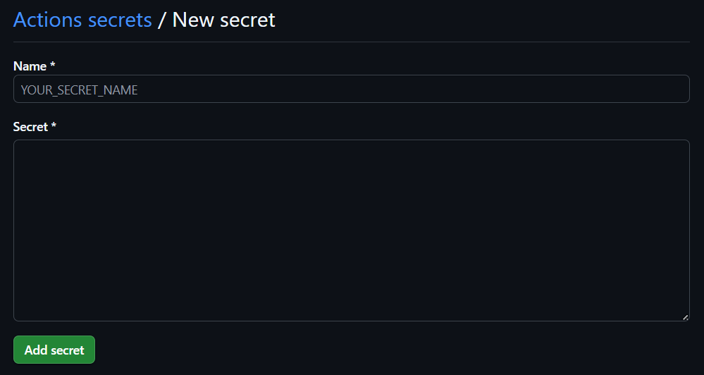

3. Set the **Name** to `AZURE_CREDENTIALS` and paste the JSON you prepared in Section 0 as the **Secret** value. Click **Add secret**.

4. Verify that the secret appears in the repository secrets list.

    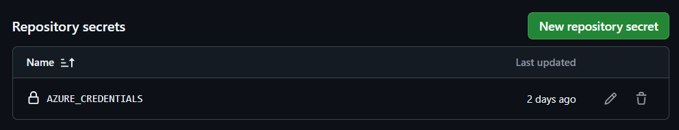

> [!WARNING]
> The `clientSecret` inside this JSON has an **expiration date** set when the service principal was created. When it expires, **all automated deployments will fail** with an authentication error. Track the expiration date, generate a new client secret in Entra ID **before** it runs out, and update the `AZURE_CREDENTIALS` secret in GitHub.

> [!NOTE]
> When you created the repository from the template, the deployment workflow may have run automatically. That run will have failed because `AZURE_CREDENTIALS` did not exist yet — this is expected. You can safely ignore or delete the failed run in the **Actions** tab.

### Overview of the deployment workflow

Open `.github/workflows/deploy.yml` in your repository on GitHub. This workflow automates the `deploy.py` script using the service principal for authentication. Here is when it runs:

| Trigger | Environment | What happens |
| --- | --- | --- |
| **Push to `main`** | `PRD` | Deploys to the production workspace |
| **Pull Request to `main`** | `DEV` | Deploys to the development workspace for validation |
| **Manual dispatch** | Your choice | You pick the workspace and environment in the GitHub UI |

The workflow steps are:

1. **Check out** the repository code
2. **Set up Python 3.12**
3. **Install dependencies** from `requirements.txt`
4. **Azure Login** using the `AZURE_CREDENTIALS` secret (via the [`azure/login`](https://github.com/marketplace/actions/azure-login) action)
5. **Run `deploy.py`** with `--spn-auth True` — this uses the Azure CLI session established by `azure/login` instead of interactive browser login

> [!TIP]
> The `allow-no-subscriptions: true` flag in the Azure Login step is needed because Fabric does not require an Azure subscription — only an Entra ID tenant.

### Requirements for automated deployment

Before GitHub Actions can deploy successfully, all of the following must be in place:

- [ ] **DEV and PRD Fabric workspaces** created with sufficient capacity (Premium or Fabric)
- [ ] **Workspace names configured** in `scripts/deploy.config`
- [ ] **Service principal** created in Entra ID with a client secret (see **[Appendix A](appendix-a-service-principal-setup.md)**)
- [ ] **Service principal authorized** to call Fabric APIs (Fabric Admin portal setting)
- [ ] **Service principal added** to both workspaces with Contributor (or higher) permissions
- [ ] **`AZURE_CREDENTIALS` secret** configured in the GitHub repository (above)

### Trigger your first automated deployment

Since you committed the `deploy.config` changes directly to `main`, the deployment workflow should already be running (or queued).

1. Navigate to the **Actions** tab in your GitHub repository.

    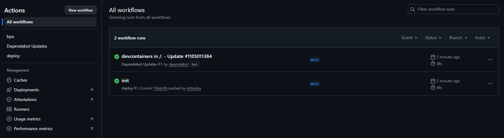

2. Click on the running workflow to see its progress.

    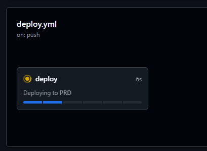

3. Once complete, the run should show a green checkmark.

    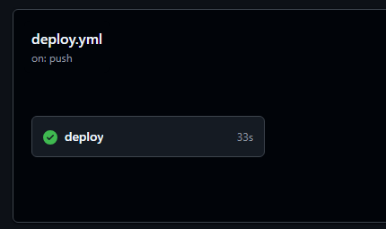

### Verify the deployment

Open your **PRD** workspace in the Fabric portal. You should see the *Sales* report and semantic model:

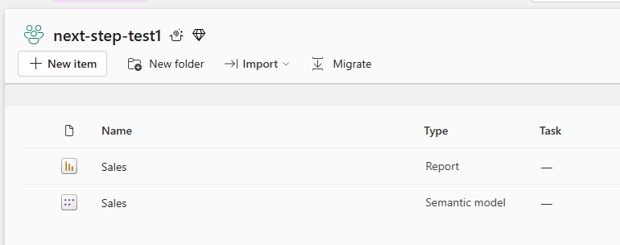

If this is the first deployment to the PRD workspace, you will need to configure data source credentials and trigger a manual refresh.

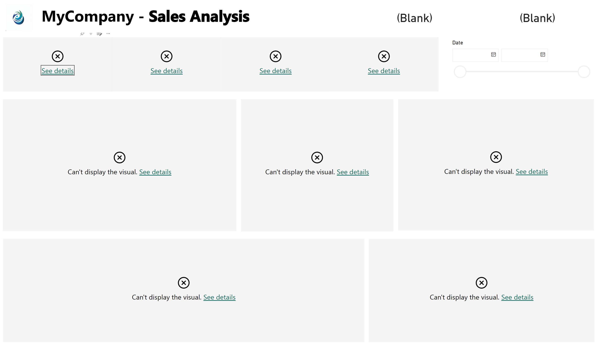

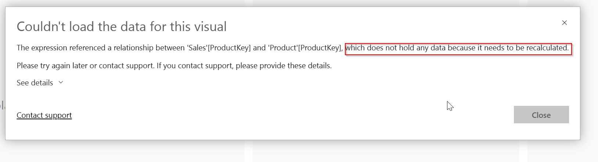

1. Take over semantic model ownership in **Settings**.
2. Configure the `Web` data source with **Anonymous** authentication.
3. Trigger a **manual refresh**.

    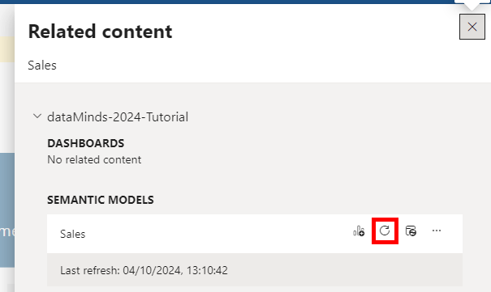

4. The report should now display data.

    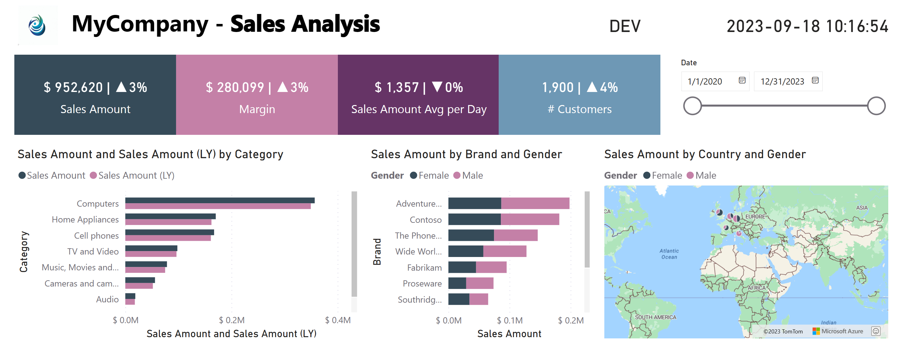

> [!TIP]
> To learn more about GitHub Actions, see the [GitHub Actions Quickstart](https://docs.github.com/en/actions/get-started/quickstart).

## 3. Best Practice Analyzer (BPA)

**Goal**: Understand the automated quality checks that validate your Power BI project.

### What is BPA?

The repository includes automated quality checks powered by two community tools:

- **[Tabular Editor Best Practice Analyzer](https://docs.tabulareditor.com/te2/Best-Practice-Analyzer.html)** — scans **semantic models** for common issues such as missing format strings, unused columns, default summarization on numeric columns, and DAX anti-patterns.
- **[PBI-InspectorV2](https://github.com/NatVanG/PBI-InspectorV2)** — validates **Power BI reports** against configurable rules covering visual density, accessibility (alt text), theme compliance, and more.

Together, these tools act as an automated code review for your Power BI project.

### Severity levels

Both tools classify rule violations into severity levels. The severity determines whether the CI/CD pipeline passes or fails:

| Severity | Effect on pipeline | When to use |
| --- | --- | --- |
| **Error** | Pipeline **fails** — the check is blocked until the issue is fixed | Critical issues that must be resolved (e.g., missing descriptions on visible columns) |
| **Warning** | Pipeline **passes** but the issue is flagged in the log | Best-practice recommendations worth reviewing (e.g., redundant DAX expressions) |
| **Info** | Logged for informational purposes only, no impact | Suggestions and style notes |

> [!IMPORTANT]
> When a BPA rule at **Error** severity is violated, the GitHub Actions workflow step returns a non-zero exit code, which fails the pipeline. **Warning** and **Info** violations are logged but do not block the pipeline.

### The BPA workflow

Open `.github/workflows/bpa.yml` to see how BPA is triggered:

- **Pull Requests to `main`** — runs automatically whenever files under `src/` are changed
- **Manual dispatch** — can be triggered manually from the **Actions** tab at any time

The workflow runs on a **Windows** runner (required by the BPA tools) and executes two steps:

1. **BPA Semantic Models** — runs `scripts/bpa/bpa.ps1` against all `.SemanticModel` folders
2. **BPA Reports** — runs `scripts/bpa/bpa.ps1` against all `.Report` folders

> [!NOTE]
> The report validation step runs even if the semantic model step fails, so you always get the complete picture in a single run.

### BPA scripts and rule files

The `scripts/bpa/` directory contains:

| File | Purpose |
| --- | --- |
| `bpa.ps1` | PowerShell script that downloads the BPA tools (on first run) and executes them against your source files |
| `bpa-rules-semanticmodel.json` | Rule definitions for semantic model validation (Tabular Editor format) |
| `bpa-rules-report.json` | Rule definitions for report validation (PBI Inspector format) |

The tools themselves (Tabular Editor CLI and PBI Inspector CLI) are automatically downloaded and cached in `scripts/bpa/_tools/` on first run — you do not need to install them manually.

> [!TIP]
> You can customize the BPA rules by editing the JSON rule files. For example, you might downgrade a rule from **Error** to **Warning** if it is too strict for your team, or add entirely new rules. See the [Tabular Editor BPA documentation](https://docs.tabulareditor.com/common/using-bpa.html) and the [PBI-InspectorV2 rules reference](https://github.com/NatVanG/PBI-InspectorV2) for details.

## 4. Branch protection setup

> [!NOTE]
> **Advanced / Optional** — This is a one-time administrative setup step. If branch protection rules are already configured in your repository, skip ahead to [Section 5: Pull Request workflow](#5-pull-request-workflow).

**Goal**: Protect the `main` branch so that changes can only land through a reviewed and quality-checked Pull Request.

### Set up branch protection rules

Since any push to `main` triggers an automated deployment to production, it is critical to protect this branch. With branch protection enabled, changes can only reach `main` through a **Pull Request**, which triggers the BPA quality checks first.

1. In your GitHub repository, navigate to **Settings > Branches** and click **Add branch ruleset**.

    

2. Provide a name for the ruleset (e.g., "Protect main") and under **Targets**, select **Default branch**.

    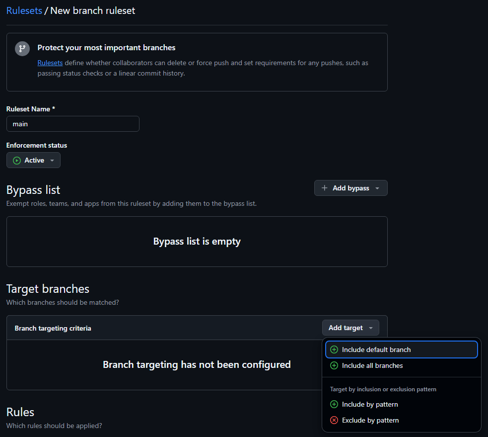

3. Enable the rules shown below. Under **Require status checks to pass**

    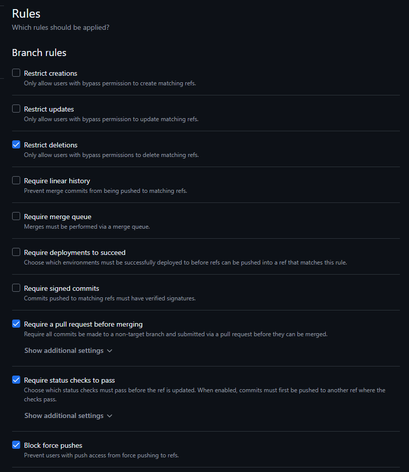

4. Save the ruleset. The `main` branch now shows a protected icon in the **Branches** overview.

    

> [!TIP]
> By requiring the **bpa** status check to pass, Pull Requests with BPA **Error**-level violations cannot be merged. This enforces quality standards automatically — no manual review needed to catch common issues.

## 5. Pull Request workflow

**Goal**: Experience the complete Pull Request workflow — from branching to merge — with BPA quality gates running automatically at every step.

This is the day-to-day development workflow when branch protection is active. Every change to `main` goes through a Pull Request, which triggers the BPA checks and a deployment to the **DEV** workspace. Only when all checks pass can the change be merged — and the production deployment triggered.

### Start work in a new branch

Create a new branch directly on GitHub or locally. Make a minor change (for example, replace all occurrences of "MyCompany" in the report with your company name), commit the change, and push the new branch to GitHub.

### Create a Pull Request

On github.com, your repository should now show a banner offering to create a Pull Request for your newly pushed branch:

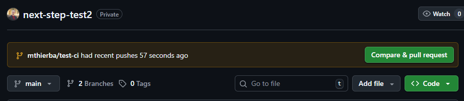

Fill in a **title** and optional **description**, then click **Create pull request**.

This triggers two workflows:
- The **BPA** workflow runs quality checks on the changed files
- The **deploy** workflow deploys to the **DEV** workspace (for validation)

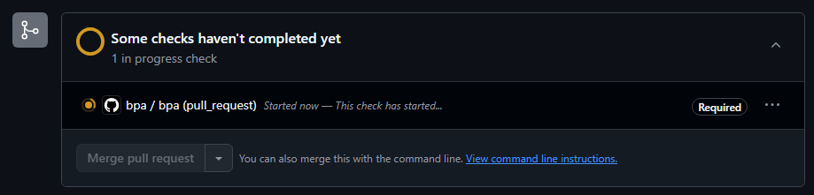

### Fix BPA issues

The BPA check is expected to **fail** at this point — one of the semantic model rules has an **Error**-level violation. This blocks the Pull Request from being merged.

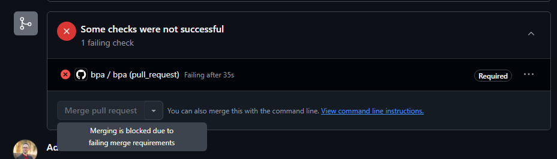

Navigate to the failed check run to see the details. Then fix the issue (either on GitHub or in VS Code), commit, and push to the same branch. The Pull Request will pick up the new commit and re-run the checks.

> [!TIP]
> See the screenshot below for a hint of what needs fixing.

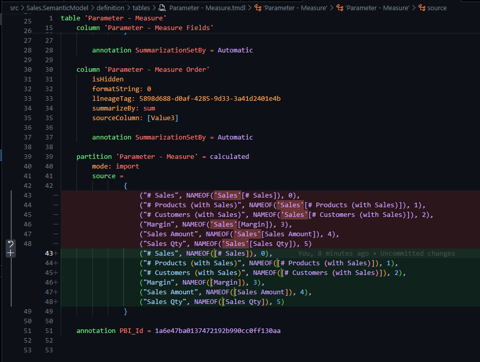

After pushing the fix, the BPA check should pass:

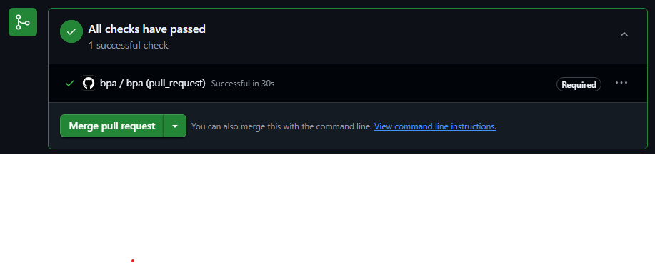

### Merge the Pull Request

Once the checks pass and you (or your reviewer) are satisfied, click the green **Merge pull request** button. This merges your changes into `main` and **automatically triggers the deployment workflow** to production.

After merging, delete the branch — the Pull Request page shows a **Delete branch** button for this purpose.

> [!NOTE]
> Deleting a branch on GitHub does **not** automatically delete it on your local machine. Remember to clean up locally with `git branch -d <branch-name>` and `git fetch --prune`.

## Wrap-up

You've now:

- Created a repository from a template with a complete CI/CD setup
- Configured a service principal and GitHub secret for automated authentication
- Triggered automated deployments to production via GitHub Actions
- Used BPA quality gates to catch issues before they reach production
- Completed a full Pull Request workflow — from branch to merge — with automated quality gates enforced at every step

### Next steps

If you want to explore further after the workshop:

- **Local deployment** — run `fabric-cicd` directly from your machine using interactive browser login. See **[Appendix: Local Deployment](appendix-local-deployment.md)** for step-by-step instructions.
- **Multi-environment parameterization** — use `src/parameter.yml` to swap workspace IDs, connection strings, or report settings per environment. See the [fabric-cicd parameterization docs](https://microsoft.github.io/fabric-cicd/latest/how_to/parameterization/).
- **Custom BPA rules** — tailor the rule files in `scripts/bpa/` to match your team's standards.
- **GitHub Environments** — use [GitHub environments](https://docs.github.com/en/actions/deployment/targeting-different-environments/managing-environments-for-deployment) for approval gates and environment-specific secrets.
- **Azure DevOps** — `fabric-cicd` works equally well with Azure Pipelines. See the [official Microsoft docs](https://learn.microsoft.com/en-us/power-bi/developer/projects/projects-deploy-fabric-cicd).

## Useful links

- [Reference repository: workshops-cicd-demo](https://github.com/RuiRomano/workshops-cicd-demo) — the template used for this lab
- [fabric-cicd documentation](https://microsoft.github.io/fabric-cicd/latest/)
- [Deploy Power BI projects using fabric-cicd](https://learn.microsoft.com/en-us/power-bi/developer/projects/projects-deploy-fabric-cicd)
- [Tabular Editor Best Practice Analyzer](https://docs.tabulareditor.com/te2/Best-Practice-Analyzer.html)
- [PBI-InspectorV2](https://github.com/NatVanG/PBI-InspectorV2)
- [GitHub Actions Quickstart](https://docs.github.com/en/actions/get-started/quickstart)
- [GitHub: About Pull Requests](https://docs.github.com/en/pull-requests/collaborating-with-pull-requests/proposing-changes-to-your-work-with-pull-requests/about-pull-requests)
- [GitHub: Protected Branches](https://docs.github.com/en/repositories/configuring-branches-and-merges-in-your-repository/managing-protected-branches/about-protected-branches)

---

## Appendices

| Document | Description |
| --- | --- |
| **[appendix-a-service-principal-setup.md](appendix-a-service-principal-setup.md)** | Step-by-step instructions for setting up a service principal in Microsoft Entra ID |
| **[appendix-local-deployment.md](appendix-local-deployment.md)** | Running deployments from your local machine using interactive browser login |
