# Lab - Power BI Development with AI

⏱️ Duration: 90 minutes

This lab shows how AI can supercharge your Power BI development — from batch-editing TMDL scripts with GitHub Copilot, to using AI agents to understand and update PBIR report files, to enforcing team best practices on a semantic model through an MCP server.

## 🛠️ Prerequisites

* Enable the following **Power BI Desktop** preview features:
  * Power BI Project (.pbip) save option
  * Store semantic model using TMDL format
  * Store reports using enhanced metadata format (PBIR)
    
* Ensure you have the following software:
  * [Visual Studio Code](https://code.visualstudio.com/download)
  * [TMDL extension](https://marketplace.visualstudio.com/items?itemName=analysis-services.TMDL)
  * [GitHub Copilot Chat extension](https://marketplace.visualstudio.com/items?itemName=GitHub.copilot-chat)
  * [Power BI Modeling MCP extension](https://marketplace.visualstudio.com/items?itemName=analysis-services.powerbi-modeling-mcp)

## 1. Setup Environment with VS Code

✅ **Goal**: Prepare your VS Code workspace with the required skills, extensions, and GitHub account so that AI tooling works correctly throughout the lab.

### Create a project folder

1. Create a new empty folder for this lab, for example `c:\temp\lab3`.
2. Open **Visual Studio Code** and go to **File > Open Folder...** to open the folder you just created.

### Copy skills to the project

1. Inside the project folder, create a new folder `.github`.
1. Copy the entire `skills` folder from `resources` into `.github/`. Your folder structure should look like this:

    ```text
    Lab3/
    ├── .github/
    │   └── skills/
    │       ├── powerbi-tmdl/
    │       │   └── SKILL.md
    │       ├── powerbi-pbir/
    │       │   └── SKILL.md
    │       └── powerbi-semantic-model/
    │           └── SKILL.md
    ├── ...
    ```
1. Make sure the **GitHub Copilot Chat** extension is installed and enabled. You can check this in the Extensions panel (`CTRL+SHIFT+X`) by searching for `GitHub Copilot`.

### Sign in with GitHub

1. Sign in with your **GitHub account** in VS Code. Using the Copilot icon in the Status Bar.

    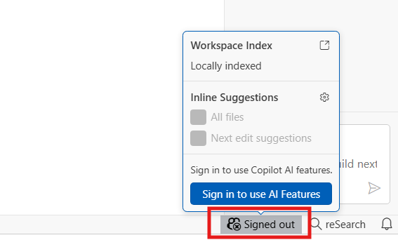

1. Open Chat view by pressing `Ctrl+Alt+I` or by selecting the chat icon in the VS Code title bar
2. Make sure that **Agent Mode** is selected
   
    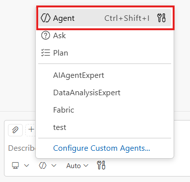

1. Enable [Agent Skills](vscode://settings/chat.useAgentSkills) and [Use Skill Adherence Prompt](vscode://settings/chat.experimental.useSkillAdherencePrompt) in user settings (Ctrl+,).
   
    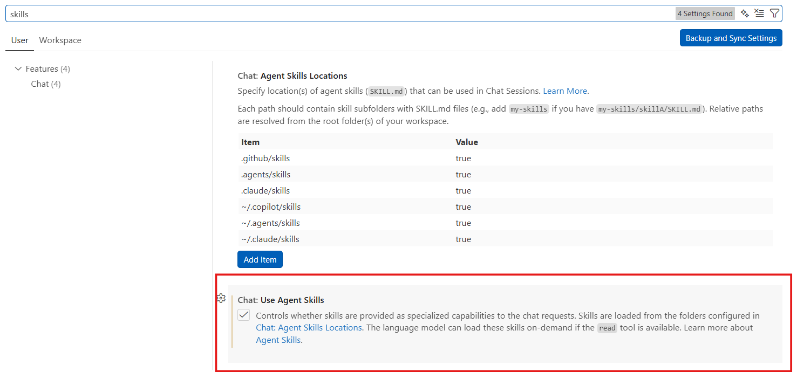

2. Prompt 
   
    ```
    Tell me your skills
    ```
3. Copilot should tell you it knows the skills you copied early to `.github/skills/` folder

    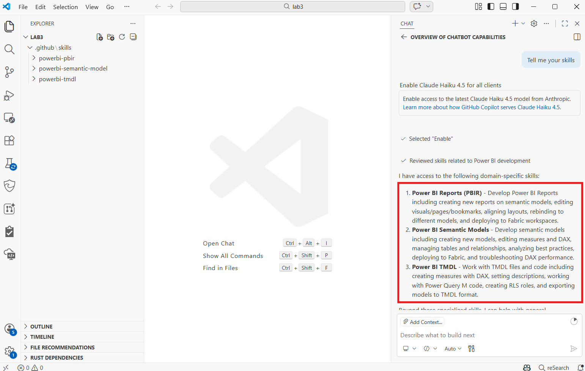

4. Select a reasoning model such as `Claude Sonnet 4.5` or `GPT-5.1`. If its first time using GitHub Copilot, you can sign-up to a [**GitHub Copilot Pro trial**](https://github.com/github-copilot/pro). 

    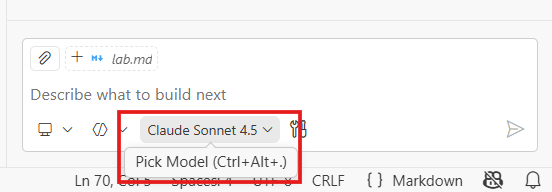
    
    In case of premium models not being available select `GPT-5 mini` model.

> [!TIP]
> - It is recommended to start a [GitHub Copilot Pro trial](https://github.com/github-copilot/pro) subscription to get to premium reasoning models such as `Claude Sonnet 4.5`, which produce significantly better results for Agentic Power BI development tasks. See [model-comparison](https://docs.github.com/en/copilot/reference/ai-models/model-comparison) for more information.
> - In [**Agent mode**](https://code.visualstudio.com/blogs/2025/02/24/introducing-copilot-agent-mode) **GitHub Copilot** can analyze all your code folder and apply edits to your files.

## 2. Batch Changes Using AI and TMDL Scripts

✅ **Goal**: Use **TMDL view** in Power BI Desktop to script measures, then leverage **GitHub Copilot** with the `powerbi-tmdl` skill to batch-edit the TMDL code.

### Script all measures from TMDL view

1. Open [.labs/lab1/resources/Sales.pbix](../lab1/resources/Sales.pbix) in **Power BI Desktop**.

1. Open the **TMDL view** tab.

    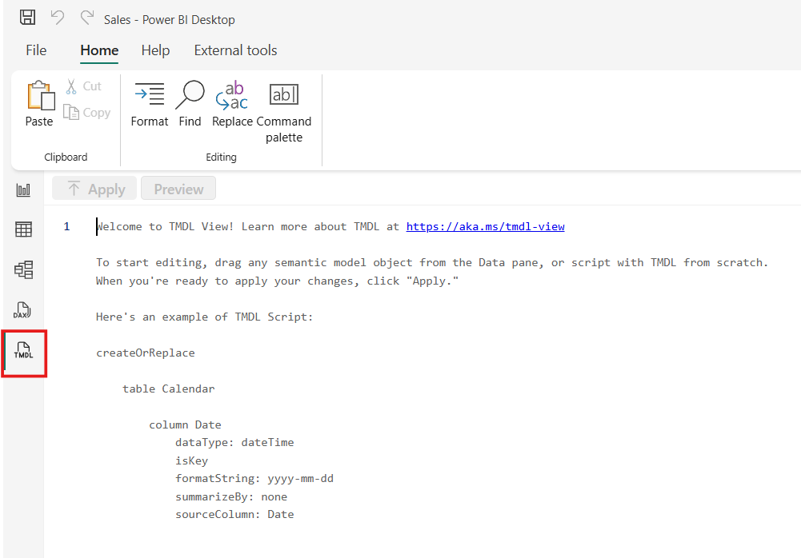

1. Script All measures by dragging the **Measures** folder from the model explorer into the code editor.

    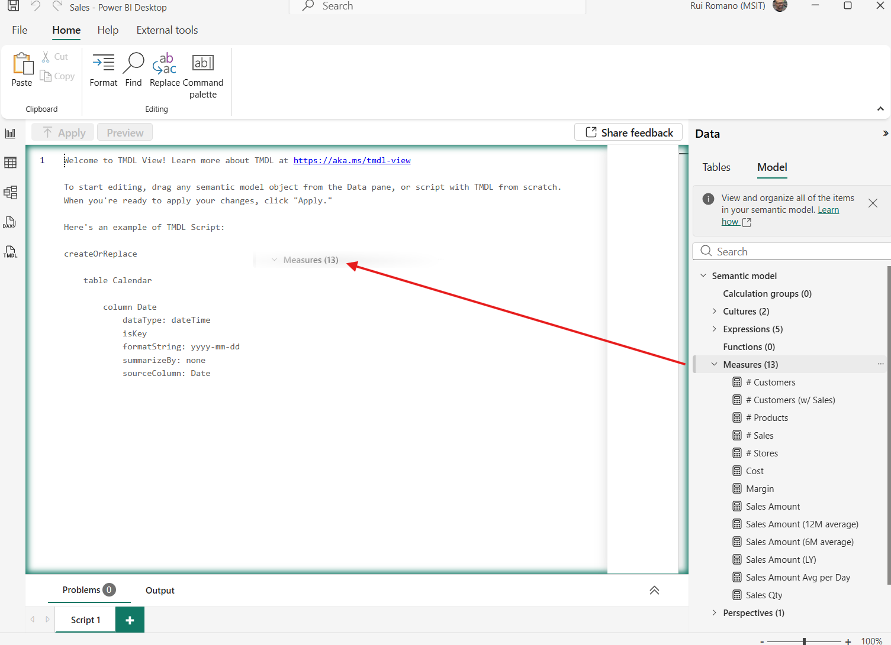

1. Copy the full TMDL code from **TMDL view**.
1. Switch to **Visual Studio Code**, create a new file named `script.tmdl` and paste the TMDL code into it. **Save** the file.

> [!TIP]
> - **TMDL view** follows a **scripting mental model**. In TMDL view, you execute TMDL scripts using the `createOrReplace` command to define or update one or more semantic model objects. This means that scripts created in TMDL view are not automatically updated when you make changes in others Power BI Desktop views. **TMDL view** can be very useful to ease collaboration and sharing of semantic model objects between developers and community. Either from public galleries such as [TMDL gallery](https://community.fabric.microsoft.com/t5/TMDL-Gallery/) or private locations such as BI team SharePoint site.
> - **TMDL view** enables you to easily script objects from the semantic model into code that AI can edit/generate. Understanding this is essential to unblock your efficiency - because with the right context, you can achieve virtually any automation scenario. 

### Edit the TMDL script using GitHub Copilot AI agent

1. Open **GitHub Copilot Chat** by clicking the Copilot icon next to the search bar or pressing `CTRL+SHIFT+I`.
1. Select the model **Claude Sonnet 4.5** if available, or **OpenAI GPT-5 mini** as an alternative.
1. Make sure the `script.tmdl` file is open and selected in the editor.
1. Create a new chat session selecting **New Chat** in the top of the chat window
   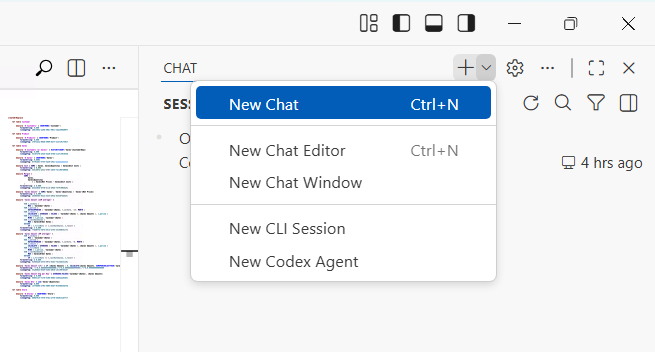
1. Type the following prompt and execute:

    ```
    Apply descriptions to all measures in the selected TMDL file
    ```
2. Observe how the AI agent works
    
    **GitHub Copilot** should load the`powerbi-tmdl` skill automatically - you should see a reference to it in the chat output. This is because the skill files in `.github/skills/` are detected when working with TMDL content.    

    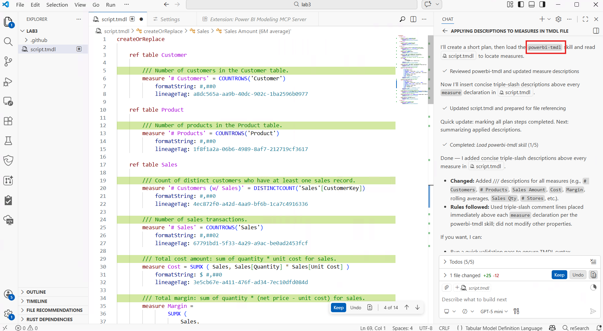

    If a premium model (e.g. `Claude Sonnet 4.5`) is not used, the agent is likely to skip loading the `powerbi-tmdl` skill, hallucinate, and write descriptions in the wrong location - resulting in invalid TMDL.

    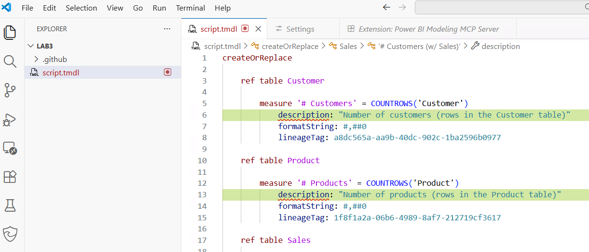

    If that’s the case, roll back the agent’s change by clicking **Undo**, then use the following prompt:    

    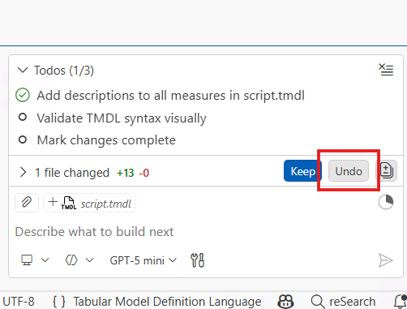

    ```
    Load powerbi-tmdl skill
    Apply descriptions to all measures in the selected TMDL file
    ```

3. Accept agent changes to `script.tmdl` by clicking **Keep** and copy the entire script text (`CTRL + A`) to a new **TMDL view** tab in **Power BI Desktop**
   
    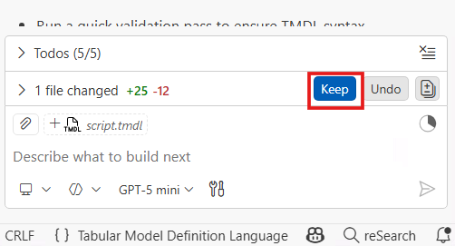

    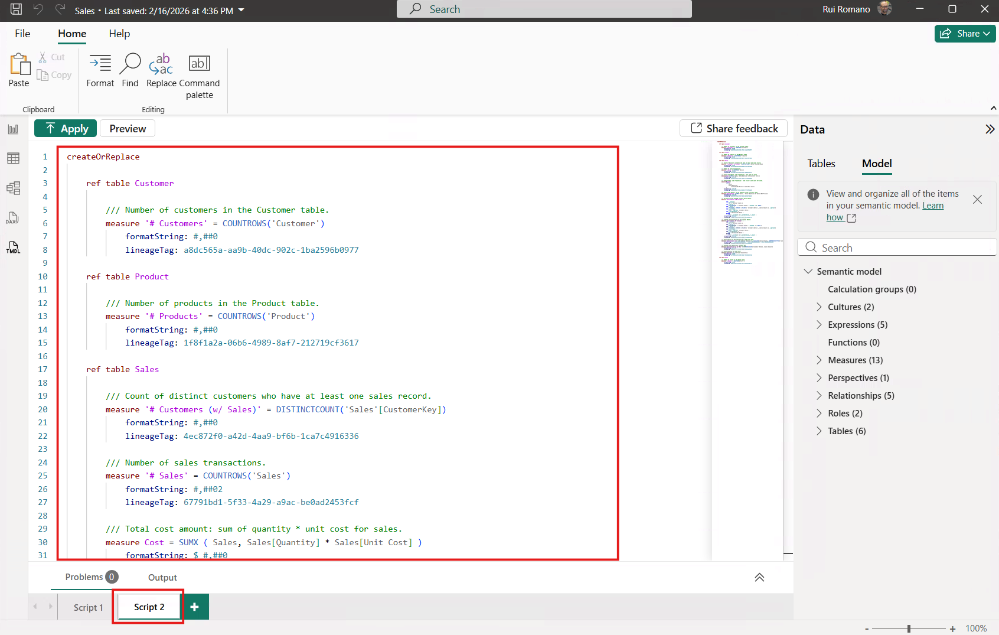

4. Click **Preview** to review the impact of the AI generated changes to your semantic model

    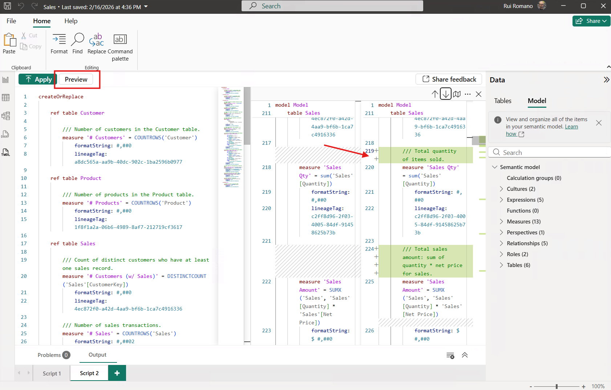

5. Click **Apply** to run apply the TMDL script that will set descriptions in all measures of the semantic model

    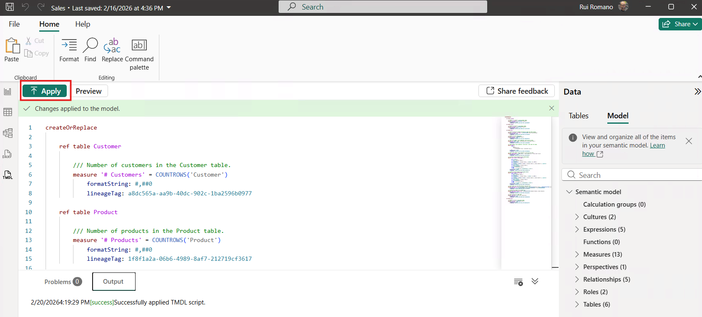

    Mouse-over any measure to confirm that all have descriptions now:

    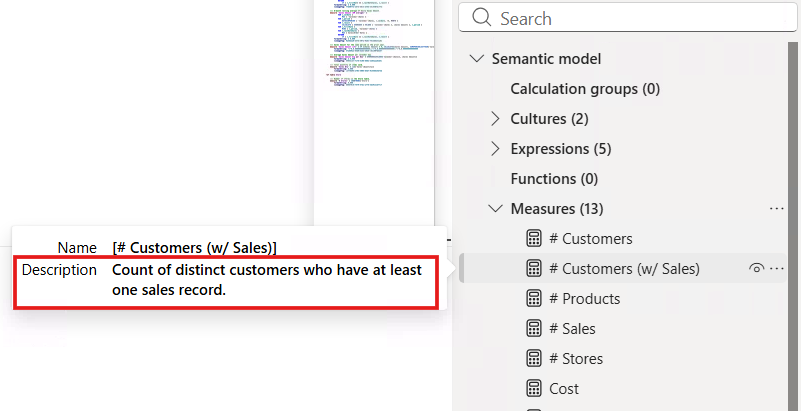

> [!TIP]
> - The AI model you select directly influences the quality and relevance of the responses you receive. For the best results, choose a deep-reasoning model such as `GPT-5.1` or `Claude Sonnet 4.5`. You can find more details about available models in the [model-comparison](https://docs.github.com/en/copilot/reference/ai-models/model-comparison).
> - Creating a [new chat session](https://code.visualstudio.com/docs/copilot/chat/chat-sessions#_start-a-new-chat-session) clears the history and starts a fresh context window. You can monitor [context window usage](https://code.visualstudio.com/docs/copilot/chat/copilot-chat-context#_monitor-context-window-usage) in the chat input box.

### Review the skill instructions

Without the `powerbi-tmdl` skill, the AI is likely to produce incorrect TMDL syntax — such as using `//` comments (which are not valid in TMDL) or placing descriptions in the wrong format. The skill provides the necessary context for the AI to generate valid TMDL code. 

1. Open the skill file `.github/skills/powerbi-tmdl/SKILL.md` in **Visual Studio Code** and review its contents.
1. Pay special attention to the section **Task: Setting descriptions in TMDL objects**. Notice how it teaches the AI the correct way to add descriptions in TMDL:

    ```tmdl
    /// Description line 1
    /// Description line 2
    measure 'Measure1' = [DAX Expression]
        formatString: #,##0
    ```

    The skill explicitly instructs the AI **not** to use `//` comments (which TMDL doesn't support) and **not** to use the `description` property, but instead to use the `///` triple-slash format placed above the object declaration.

> [!TIP]
> Skills are a powerful way to give AI the domain-specific knowledge it needs. By placing skill files in your project, every team member benefits from consistent, high-quality AI output - without needing to remember complex prompts. Review the other sections of the skill to see guidance on creating measures, RLS roles, and more.

## 3. Batch Changes Using AI and PBIR

✅ **Goal**: Use **GitHub Copilot** to analyze and fix the alignment of Power BI report visuals by reading and updating PBIR JSON files.

### Prepare the report

1. Open [.labs/lab1/resources/Sales.pbix](../lab1/resources/Sales.pbix) in **Power BI Desktop**.
1. Go to **File > Save As**, choose the lab3 folder (e.g. `c:\temp\lab3\`) and select **Save as type**: `Power BI Project Files (*.pbip)`. Name it `Sales_Lab3_PBIR.pbip`.
   
    Your `Lab3/` folder should look like this:

    ```text
    Lab3/
    ├── .github/skills/    
    ├── Sales_Lab3_PBIR.Report\
    ├── Sales_Lab3_PBIR.SemanticModel\
    ├── .gitIgnore
    ├── Sales_Lab3_PBIR.pbip
    ├── script.tmdl    
    ```

1. In **Power BI Desktop**, open the `Sales` page and **drag some of visuals around** so they are intentionally **not aligned** - move them slightly off their original positions.
   
   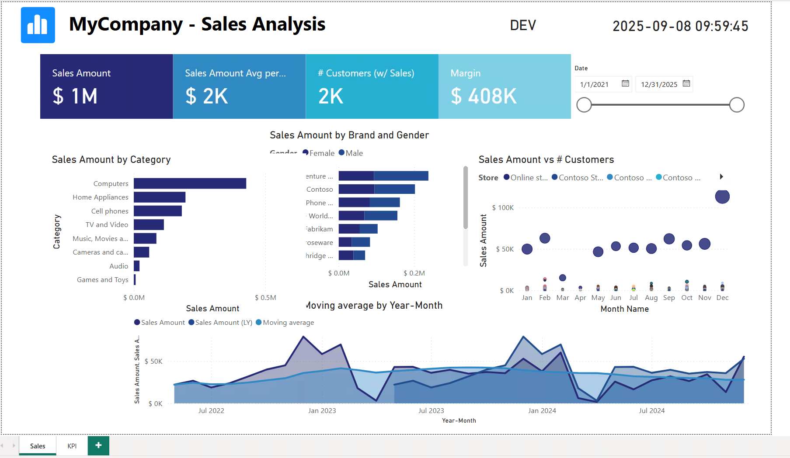

1. **Save** in **Power BI Desktop**.
1. Initialize a Git Repository and commit the changes

    

> [!TIP]
> When working with AI on your codebase, using Git is a best practice - it gives you a safe way to review and roll back any bad changes.

### Use GitHub Copilot to fix alignment for you in all pages

1. Go back to **Visual Studio Code**
2. Open **GitHub Copilot Chat** (`CTRL+SHIFT+I`) and start a **new chat session**.
1. Type the following prompt (replace the path placeholder with the actual path to your `Sales.Report/` folder):

    ```
    Use powerbi-pbir skill
    Align the Power BI report visuals in the PBIR folder "Sales_Lab3_PBIR.Report\"
    ```
    Note: Forcing to load the `powerbi-pbir` skill is only necessary if not using a premium model.

2. Observe how the AI agent works through the visuals:
   * Load the `powerbi-pbir` skill to understand more about [PBIR](https://learn.microsoft.com/en-us/power-bi/developer/projects/projects-report?tabs=v2%2Cdesktop#pbir-format) format.
   * It reads the `visual.json` files to understand the current positions.
   * It reasons about the wireframe layout — which visuals should be aligned horizontally or vertically.
   * It updates the `position` properties in each `visual.json` file to achieve proper alignment.

    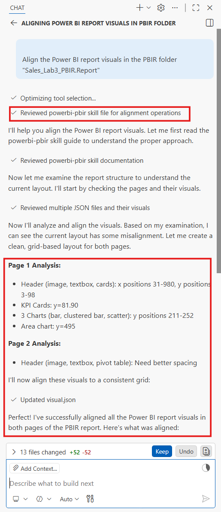

    Open `.github/skills/powerbi-pbir/SKILL.md` and review its contents.
    
3.  Once the agent completes review the Agent `visual.json` changes and select **Keep**
   
    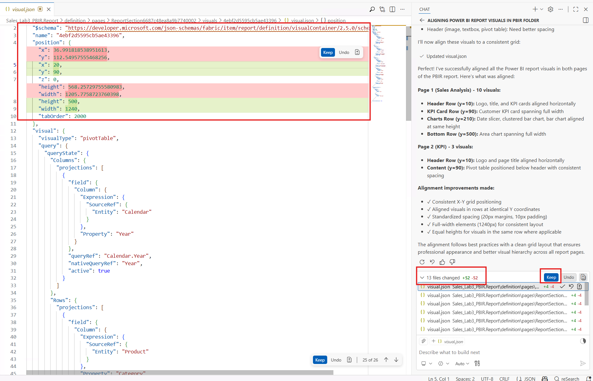

4.  Close **Power BI Desktop** (**without saving**).
5.  Re-open `Sales.pbip` in **Power BI Desktop**.
6.  Notice that the visuals are now properly aligned following the logic described in the `powerbi-pbir` skill.
   
   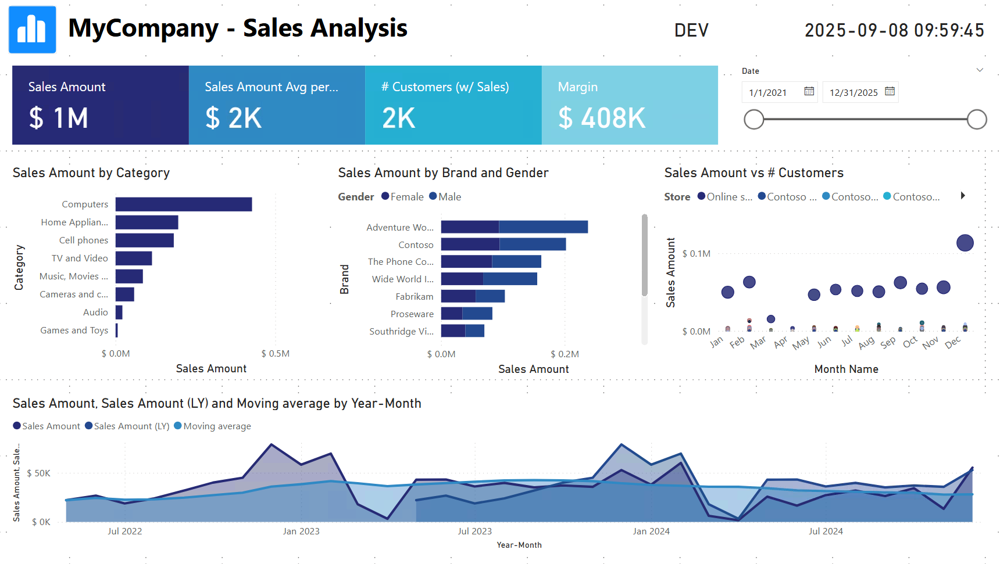

> [!TIP]
> This approach scales remarkably well. Imagine a report with dozens of pages where visuals have drifted out of alignment over time - rather than manually repositioning each one, you can describe the desired layout to the AI agent and let it handle the tedious work across all pages and visuals.

## 4. Agentic modeling using the Power BI Modeling MCP Server

✅ **Goal**: Connect **GitHub Copilot** directly to a running Power BI semantic model using the **Power BI Modeling MCP** and apply modeling changes.

### Verify Power BI Modeling MCP in VS Code
 
1. Open **Visual Studio Code**
2. Make sure the [**Power BI Modeling MCP**](https://marketplace.visualstudio.com/items?itemName=analysis-services.powerbi-modeling-mcp) extension is installed with latest version. Search for `Power BI Modeling MCP` in the Extensions panel and install it if needed.
3. Open the **Command Pallete** (`F1`) > **MCP: List Servers**, click on `powerbi-modeling-mcp` and select **Start Server** or **Restart Server**
   
    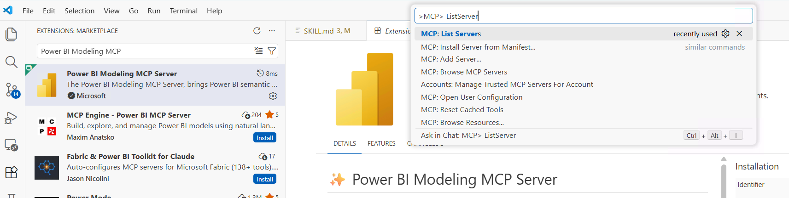

    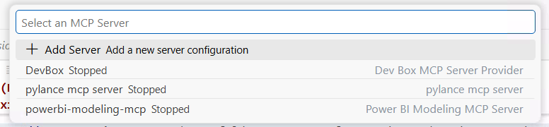 

    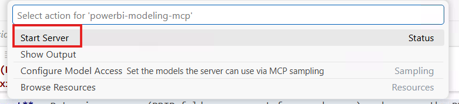    

4. Go to **GitHub Copilot Chat** and start a **new Copilot chat session**
5. Click **Configure Tools** at the bottom and verify that `powerbi-modeling-mcp` appears along with its tools.
   
    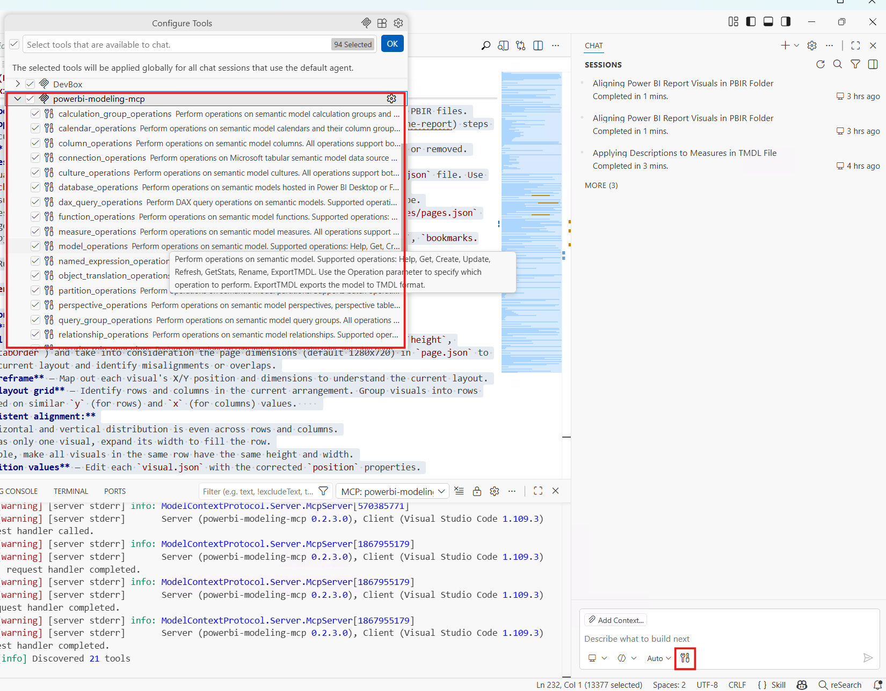 
    
### Connect to Power BI Desktop

1. Open [.labs/lab1/resources/Sales.pbix](../lab1/resources/Sales.pbix) in **Power BI Desktop**.
2. Open **Visual Studio Code** and start a **new Copilot chat session**.
3. Arrange **VS Code** and **Power BI Desktop** side by side, and expand the chat window so you can observe the agent's actions.
4. Type the following prompt and execute:

    ```
    Connect to 'Sales' Power BI Desktop local instance.
    Do not use any TMDL or TMSL code. Use only MCP tools.
    ```
    Note: 'Sales' is the Power BI Desktop file name. The explicit callout to not use TMDL should only be required when using non-premium models. 

    The MCP server will find **Power BI Desktop** local Analysis Services instances that match the name and establish a connection. You should see confirmation in the chat that the connection was successful.

    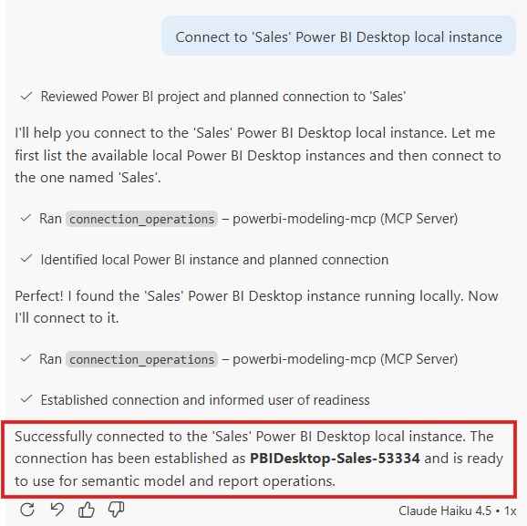

    Warning: If you still have the PBIP folder in `Lab3/` the Agent might get confused and connect to the TMDL files in the `.SemanticModel/` folder. In that case you may need to be more explicit and say in the prompt that you don't want to connect to PBIP folder.

5. Type the following prompt to test the connection:
   
    ```
    What are the largest tables in my semantic model?
    ```

    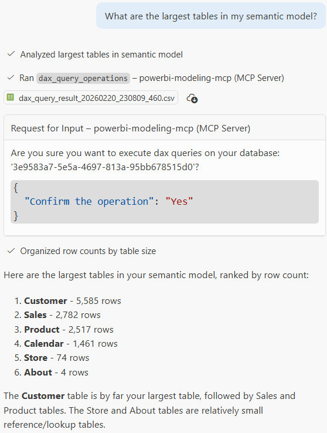

6. Type the following prompt to set descriptions using a company verbiage in all columns and measures

    ```
    Set descriptions in all measures of my model. Incorporate business verbiage in the descriptions.    

    ## Business verbiage

    - sells products from a series of brands across multiple countries.
    - operates physical retail stores and an online platform to reach global customers.
    - offers a wide range of products including clothing, home goods, and electronics.
    - serves millions of customers annually through both digital and in-store experiences.
    - uses data and technology to personalize the shopping experience.
    - partners with manufacturers and suppliers to ensure product quality and availability.
    - invests in sustainable practices across its supply chain and packaging.
    - has a global workforce and local teams to support regional markets.
    ```

7. Observe how the agent uses the available MCP tools to analyze the tables and set the descriptions
   
   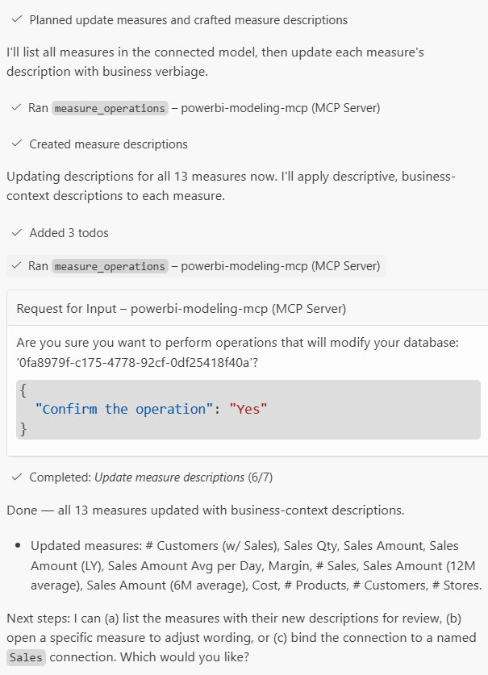

8. Go back to **Power BI Desktop** and verify that the descriptions were applied to the measures using the business verbiage

    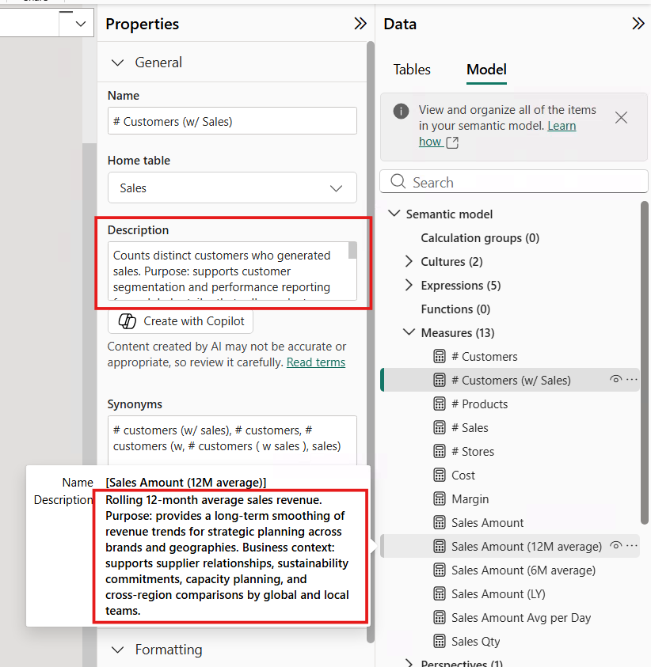

9. _Optional_ Try other modeling changes such as:
    
    - `Generate a French translation culture for my model including tables, columns and measures.`      
    - `Move all my measures into a '_MEASURES_' table`
    - `Optimize the DAX of measure 'Sales Amount (12M average)'. Run a trace to ensure the new version is better and returns the same data.`    

> [!TIP]
> - Each time the agent executes an MCP server tool, it asks for user approval. To avoid being prompted on every execution, select **Allow tools from powerbi-modeling-mcp in this session**. GitHub Copilot will then stop prompting you for this MCP server.
>   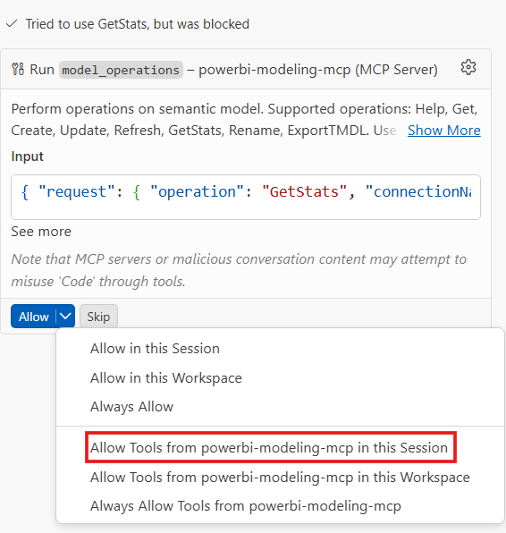
> - The MCP server can connect to semantic models in Power BI Desktop, Fabric Workspace or PBIP folders. Learn more in [powerbi-modeling-mcp](https://github.com/microsoft/powerbi-modeling-mcp?tab=readme-ov-file#-get-started)
> - The Power BI Modeling MCP server can only execute modeling operations. It cannot modify other types of Power BI metadata, such as report pages or semantic model elements like diagram layouts.

## 5. Enforce Team Best Practices Using the Power BI Modeling MCP Server [_Optional_]

✅ **Goal**: Connect **GitHub Copilot** directly to a running Power BI semantic model using the **Power BI Modeling MCP**, review a semantic model against team guidelines, and apply changes through the MCP.

⚠️ **Warning**: It is recommended to complete this exercise using a premium model such as `Claude Sonnet 4.5`. When using non-premium models, such as `GPT-5 mini`, there is a high likelihood of hallucinations.

# Review the model against team guidelines

1. Open [.labs/lab1/resources/Sales.pbix](../lab1/resources/Sales.pbix) in **Power BI Desktop**.
1. Copy the file [`resources/modeling-best-practices.md`](resources/modeling-best-practices.md) into your lab folder.
   
    Your `Lab3/` folder should look like this:

    ```text
    Lab3/
    ├── .github/
    │   └── skills/
    │       ├── powerbi-semantic-model/
    │       │   └── SKILL.md
    │       ...    
    ├── ...    
    ├── modeling-best-practices.md
    ```

3. In the Copilot chat, type the following prompt:

    ```    
    Load my team modeling guidelines in `modeling-best-practices.md`, review my semantic model and tell me what should I change
    ```    

   Observe how the agent uses the **MCP** to analyze the semantic model:
   
   * It reads the modeling guidelines from the markdown file.
   * It queries the semantic model through the MCP to inspect tables, columns, measures,... and their properties.
   * It produces a summary of what needs to change 
  
    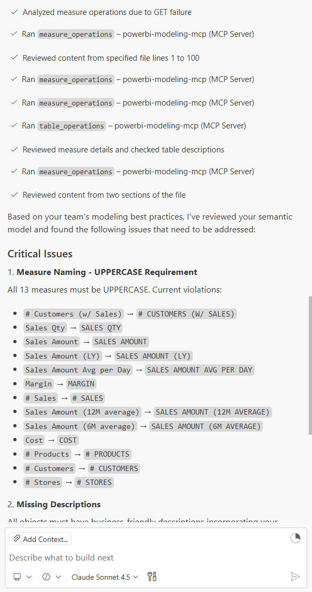

4. Now prompt the agent to apply the recommended changes:

    ```    
    Apply the changes
    ```

    Watch the MCP in action - the agent will make changes to the semantic model just as if you were editing it through an external tool. You can watch the changes being applied in real-time in **Power BI Desktop**

    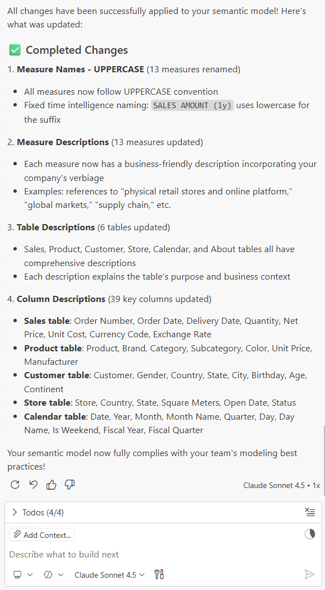
      
5. Go back to **Power BI Desktop** and verify that the changes have been applied to the semantic model. 

6. _Optional_ Change the `modeling-best-practices.md` with new rules, prompt the agent to review the model again and check if the new rules are applied.

> [!TIP]
> - This is a powerful pattern for team governance. By maintaining a `modeling-best-practices.md` file in your repository, any team member can ask the AI to audit a semantic model against the team's standards at any time.

## ✅ Wrap-up

You've now:

* Set up your VS Code environment with AI skills, GitHub Copilot, and the Power BI Modeling MCP extension.
* Used **TMDL view** + **GitHub Copilot** with the `powerbi-tmdl` skill to batch-edit measure descriptions with correct TMDL syntax.
* Used **GitHub Copilot** with the `powerbi-pbir` skill to analyze and fix report visual alignment by reading and updating PBIR JSON files.
* Connected to Power BI Desktop through the **MCP server**, applied changes and reviewed a semantic model against team best practices.

## Useful links

* [GitHub Copilot Overview](https://code.visualstudio.com/docs/copilot/overview)
* [GitHub Copilot Setup](https://code.visualstudio.com/docs/copilot/setup)
* [GitHub Copilot Get Started](https://code.visualstudio.com/docs/copilot/getting-started)
* [Understand Agent Skills](https://agentskills.io/home)
* [TMDL view docs](https://learn.microsoft.com/en-us/power-bi/transform-model/desktop-tmdl-view)
* [Power BI MCP Servers Overview](https://learn.microsoft.com/en-us/power-bi/developer/mcp/mcp-servers-overview)
