# Lab 3 — Git for Power BI Developers

Duration: 30 minutes

## Goals

- Put a PBIP project into Git and learn a VS Code-centric local Git workflow
- Use local branches, commits, switch branches, stash, revert, and reset
- Resolve simple merge conflicts locally and explain `.gitignore` entries for PBIP

## 🛠️ Prerequisites

- Completed Labs 1 & 2 (PBIP, TMDL, PBIR)
- Visual Studio Code with Git installed and the extensions recommended in Lab 1 (TMDL, Fabric, PowerShell)
- Git installed on local machine

## 0. Setup

### Git configuration

On a new command prompt, run `git --version` to check that Git is installed and you have a recent version on your machine:

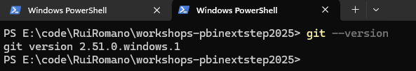

The latest version is 2.51.0 (as of Sep 2025), however, any relatively recent version will do.

Easiest way to install/upgrade Git is via `winget` (Windows Package Manager):

    winget install git.git

All git commits will be tagged with your name and email as an identifier. Check the current settings:

If no values are returned or you want to change them, do so via:

    git config --global user.name "Your Name"
    git config --global user.email your@email.com

If you are working with GitHub, and are likely to make contributions to public repositories, it is strongly advisable for privacy reasons not to use your real email address here. GitHub allows, under [Email Settings](https://github.com/settings/emails) to configure a unique email address that is safe to use in a public context - that special `@users.noreply.github.com` address identifies you without exposing your real email address.

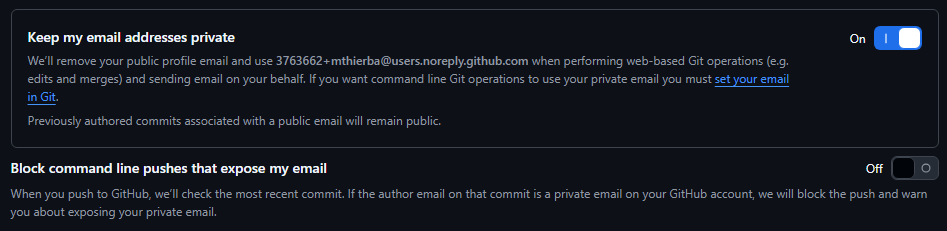

> [!IMPORTANT]
> It is important that those settings are in place before your start using git.

Ensure the git default branch is set as "main":

    git config --global init.defaultBranch main

### PBIR Preview Option

Ensure that all PBIP related Power BI Desktop preview features are enabled:

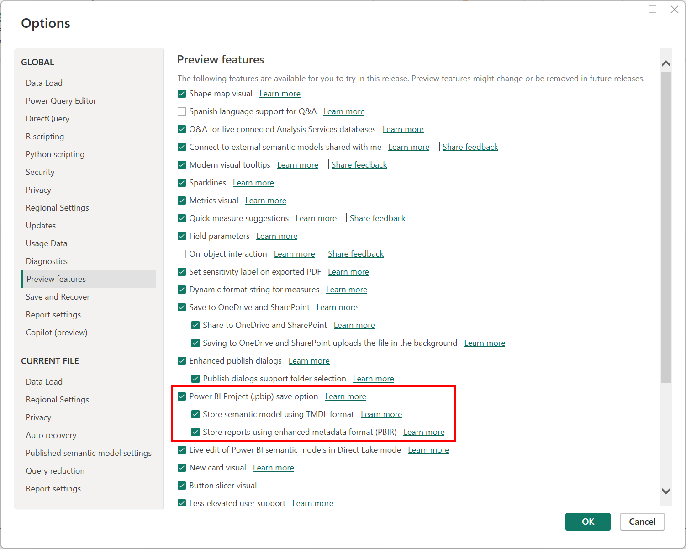

## 1. Create new local project folder

Create a new, empty, project folder on your machine, alongside *this* labs workspace. Copy all files/folders from *this* workspace, skipping those:

- `.labs/**`

Should your source folder have a `.git/` directory, make sure to SKIP that and not copy it across.

The resulting project folder should contain:

- `.bpa/`
- `.devcontainer/`
- `.github/`
- `.vscode/`
- `scripts/`
- `src/Sales.Report/`
- `src/Sales.SemanticModel/`
- `src/.gitignore`
- `src/parameter.yml`
- `src/Sales.pbip`
- `.gitignore`
- `README.md`

We are initiating a new Power BI project, starting from a template. It is important to use source control through git as early as possible so that all development activities are tracked and documented. Let's enable this new project for source control and commit all files we have so far to git, even before opening the report in Power BI Desktop.

Open the folder in Visual Studio Code:

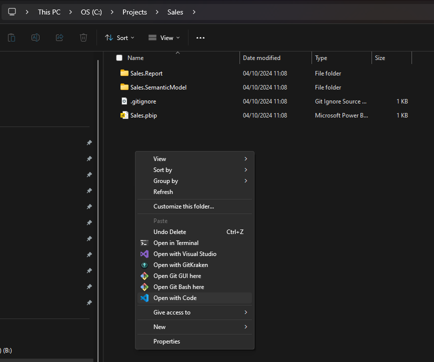

## 2. Initialize a local git repository and commit the PBIP files

Inside VS Code, navigate to the "Source Control" tab:

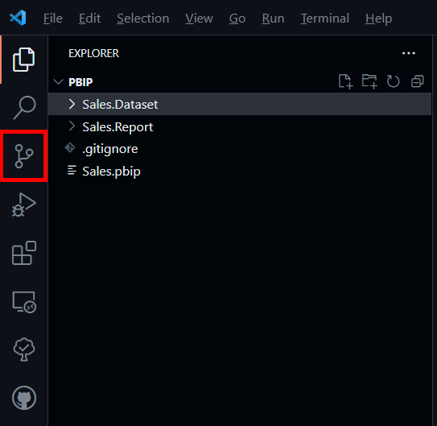

### Initializing git for the project folder

Visual Studio Code makes it very easy to get started with Git on a new project. Click the green "Initialize Repository" button:

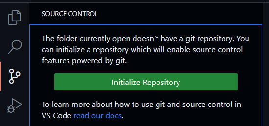

The Source Control panel now shows untracked changes across a large number of files:

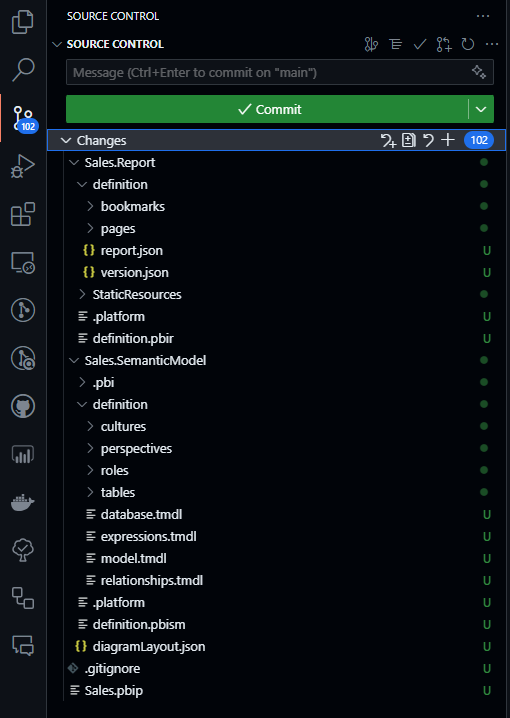

If you go back to your project folder in Windows Explorer, and have *Show Hidden Items* enabled, you'll notice a new (hidden) ".git" subfolder. This is where Git stores all its internal metadata for your project.

> [!IMPORTANT]
> Never edit/remove any files in that folder.

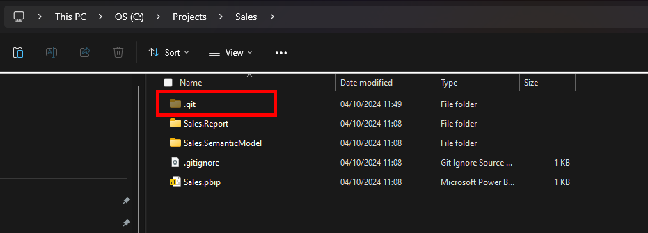

### Default branch name

In the Visual Studio Code footer bar, you'll see the default Git branch name. Historically, that branch was called "master". Some years ago, the convention has changed to "main" for the default branch. (Earlier during the lab you configured your local git to follow to new "main" branch convention.)

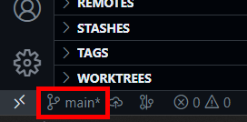

### Make an initial commit

Now, store the current version of all files in your Git version history. Provide a descriptive message (for instance, "Initiating new Power BI project") and click "Commit". Then confirm the dialog with "Yes".

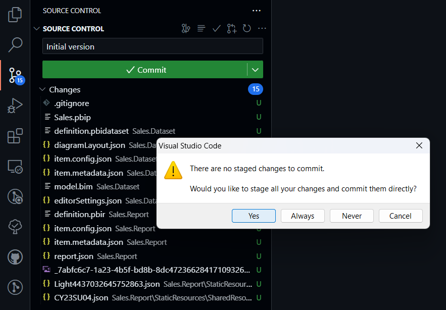

> [!IMPORTANT]
> It is a common mistake to forget the commit message at this point. vscode will open a new cryptic-looking text file named `COMMIT_EDITMSG` in that case, like:

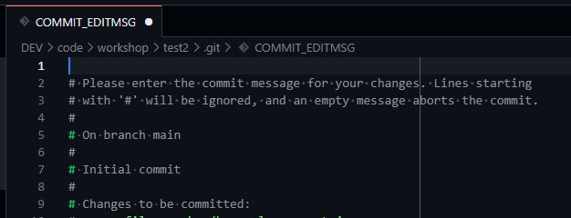

In this case, simply type your commit message in the first (blank) line anc close that tab. You will be prompted to save changes, and once confirmed, the commit will go ahead.

Once committed, the source control panel clears and shows no further pending changes.

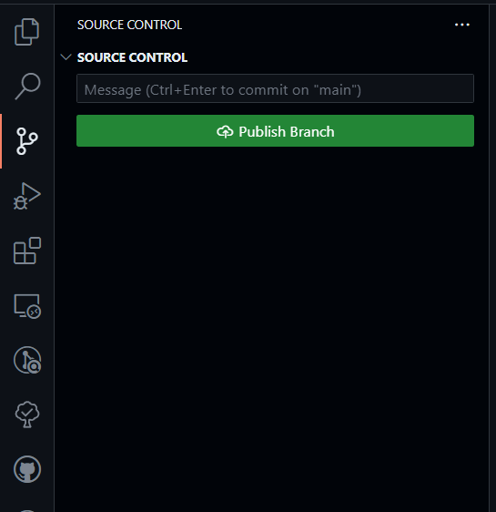

> [!NOTE]
> Now you are safe to experiment with your project freely since you can always go back to the saved state via Git.

## 3. Make local changes and commit them

Then open `Sales.pbip` in Power BI Desktop.

As you learned in lab 1, this is the equivalent of opening a PBIT file - the PBIP sources only contain definitions for the report and semantic model, but no data (yet). Hence, the report will come up as blank. Unlike opening from PBIT, however, you will not be prompted automatically to provide/confirm model parameters and load data first.

### Load data

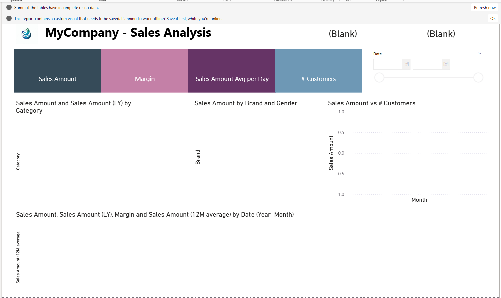

Explicitly click the "Refresh now" button. If/when prompted, specify _Anonymous_ access for the "https://raw.githubusercontent.com/" web resource:

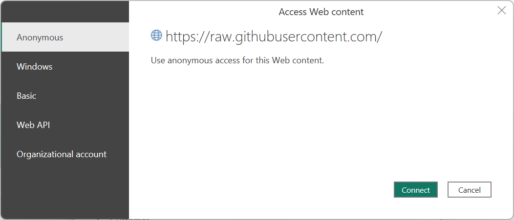

The refresh will then kick off and should complete swiftly.

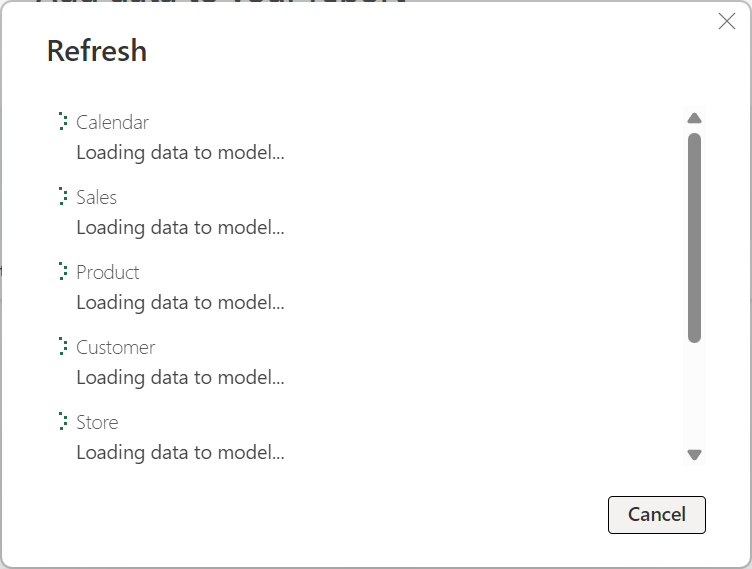

Your report now has its visuals populated with data:

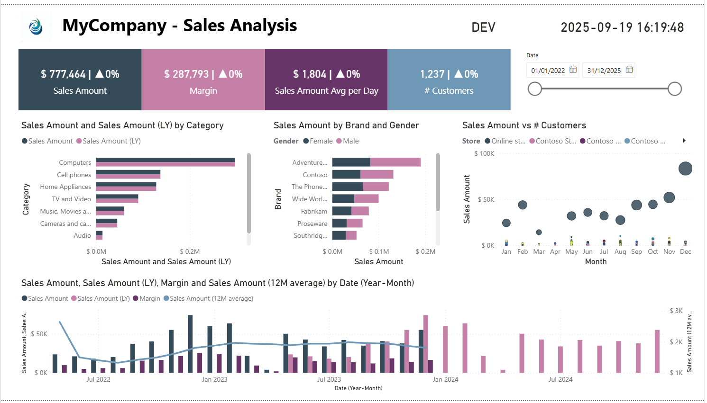

Inside Power BI Desktop, click Save, then go back to vscode.

### Make report changes and revert them

With the git format enabled, you get immediate benefits as a developer:
• A granular view of changes made in code
• The ability to roll back the entire project to a previous state

Re-open the "Sales.pbip" in Power BI Desktop and make any number of changes to the report. Save changes and close.

After a few moments the vscode "Source Control" tab will list all changed file. Selecting any one of them opens a rich before/after diff view of that file on the right.

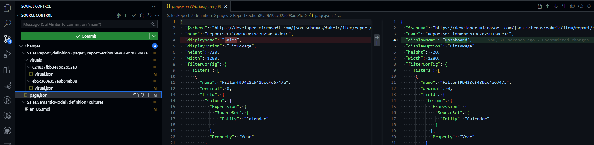

Find the "Discard all changes" button to the right of the "Changes" node. Selecting it reverts all changes you just made and resets your local working copy to your last commit.

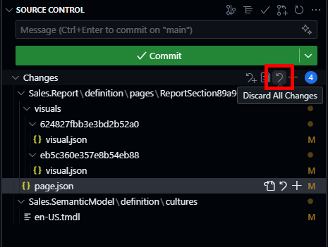

Since this is a destructive action, vscode requires an explicit confirmation.

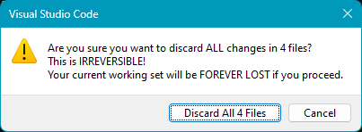

### Create a local branch and make offline changes

For the final lab section, we are going to walk through a feature branch workflow on your local machine, making offline changes to the project.

Before we make any further changes, we create a new isolated feature branch. Find the branch indicator on the left side in the status bar and click on the branch name ("main").

Then select "Create new branch…" from the upcoming options and enter a new branch name. By convention, since this is an isolated feature branch, your initials should be included in the branch name.

The branch name indicator in the status bar is now changed.

Launch Tabular Editor (2). Select the "Open/From Folder…" option and navigate to the "Sales.SemanticModel/definition" folder. 

This opens the tabular model from our PBIP project in Tabular Editor.

Find the "About" table and create a new measure there.

Set the name as "Version" and the DAX expression as '"1.0"' (the double-quotes are required!).

Press the Save button and go back to the Source Control tab in vscode. You now see the "tables/About.tmdl" files as modified and potentially also "database.tmdl".

The About table has your new measure defined, with an auto-generated lineage tag.

Enter a meaningful commit message, press "Commit" and confirm the following dialog.

Now, let's edit the report in Power BI Desktop so we can display the new measure for users to see. Like before, open the "Sales.pbip" file.

The new measure shows up inside the model explorer.

Using a Card visual, pull the measure onto the report surface.

Then close and save the report and go back into vscode.

Again, the Source Control tab will show various changes. One of those contains the definition for the new card visual.

Providing a message first, commit all changes.

The Source Control is now empty (there are no further uncommitted changes).

This concludes the PBIP with Git lab.

## ✅ Wrap-up

You’ve now:

- Enabled git source control for a new Power BI project on your machine
- Used the Source Control panel in Visual Studio Code
- Made git commits with associated commit messages
- Created local git branches and used them to experiment with and revert changes
- Reviewed local changes using the vscode diff view

## Useful links

- [Using Git Source Control in Visual Studio Code](https://code.visualstudio.com/docs/sourcecontrol/overview)
- [Introduction to Git in vscode](https://code.visualstudio.com/docs/sourcecontrol/intro-to-git)
- [Git Official Homepage](https://git-scm.com/)
- [GitKraken Git Tutorials](https://www.gitkraken.com/learn/git/tutorials)
