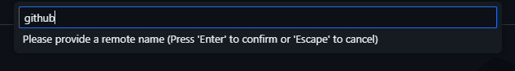
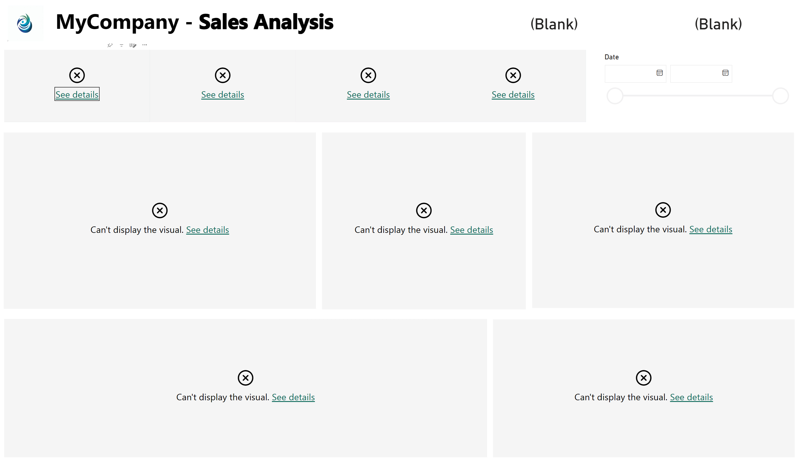
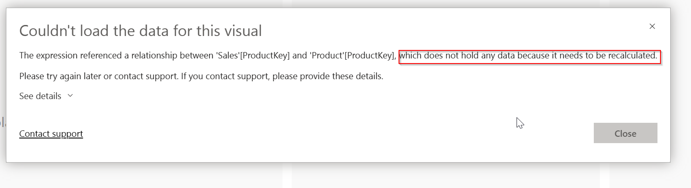
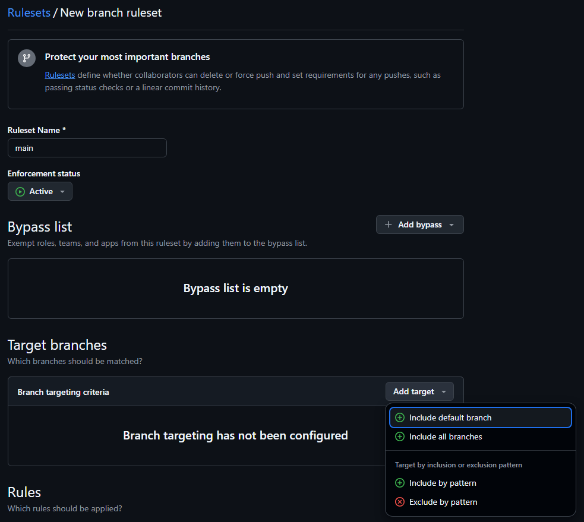
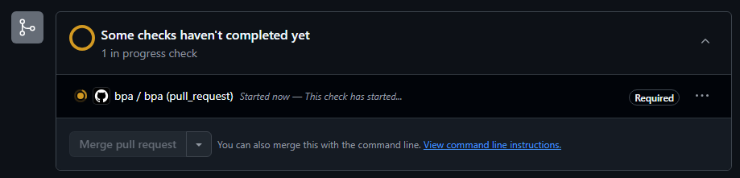

# Lab 4 — CI/CD with GitHub Actions

Duration: 60 minutes

Whilst the previous lab introduced you to Git basics and made you familiar with core Git concepts and activities, this final lab is going to move focus to a remote Git server, introduce collaborative workflows and automated CI/CD pipelines. It builds directly on top of your working files from Lab 3.

## Goals

- Wire a PBIP repository to GitHub Actions to run validations and automated deployments
- Configure deployment credentials and repository secrets
- Inspect and troubleshoot a pipeline run

## 0. Setup

### Deployment Credentials (Service Principal)

Let's first create a service principal to use for automated deployments. Service principals are identities in Entra ID that are associated with machines or applications, not human users. Inside the Azure portal, these are called "Applications". Inside the tenant you're using for this lab, navigate to **Entra ID > App registrations > New registration ([Shortcut](https://portal.azure.com/#view/Microsoft_AAD_RegisteredApps/CreateApplicationBlade/quickStartType~/null/isMSAApp~/false)).

Enter a recognizable name (for instance, "Power BI Deployment Principal"), and keep the "Single tenant" option selected. Make no further changes and confirm.

The application details are now displayed. Take note of the "Application ID" as well as the "Tenant ID". Then, select the "Add a certificate or secret" link:

In our deployment pipeline, the service principal will be authenticated using a "client secret" (aka "password") that is generated by the Azure Portal on the next screen.

> [!IMPORTANT]
> The secret/password will only be displayed once on the next page and you MUST copy and store the value safely.

Note that it is required to select a secret expiration. It is very important for you to take note of those expiration dates and manage secret rotation in advance, before automated processes collapse due to expired secrets. New secrets can be generated at any point, and multiple secrets can overlap. However, once a specific secret is expired it can no longer be used, nor can it be renewed or extended - a new secret must be created.

- Reference: [Register an application in Microsoft Entra ID](https://learn.microsoft.com/en-us/entra/identity-platform/quickstart-register-app)

### Authorize Deployment Credentials to use Fabric APIs

With the service principal created and a client secret in place, the service principal needs to be authorized to use Fabric APIs. This takes place in the Fabric Admin portal, not in Entra ID or Azure. The "Service principals can call Fabric public APIs" must be enabled. Furthermore, it can be enabled globally for all service principals or restricted to only those service principals that are members of explicitly listed groups.

Whilst there is administrative overhead, it is **strongly** recommended to use the latter option in a production tenant.

With group-scoped authorization configured, add your new service principal to any of the authorized security groups.

### Create deployment workspace in a Premium/Fabric Capacity

Finally, create a new Fabric workspace in a supported capacity and add the service principal to the workspace with edit permissions (Contributor/Member/Admin role):

## 1. Create and configure a GitHub repository

[Create a new GitHub repository](https://github.com/new) to host the project from Lab 3. Decide owner, name, and visibility.

Copy the repository url shown here as we'll need it in a subsequent step. With the new repository created, some settings need to be provided to enable automated deployments. You will need the service principal details from the previous step.

Navigate to Settings > Security > Secrets and variables > Actions:

Then create three new repository secrets with the corresponding values: `FABRIC_CLIENT_ID`, `FABRIC_CLIENT_SECRET`, `FABRIC_TENANT_ID`.

Finally, create one repository variable `workspace`, containing the Fabric workspace name.

Those settings are ultimately required in your new repository:

| Setting | Name |
| --- | --- |
| Secret | `FABRIC_CLIENT_ID` |
| Secret | `FABRIC_CLIENT_SECRET` |
| Secret | `FABRIC_TENANT_ID` |
| Variable | `workspace` |

### Configure a Git remote

Now the new GitHub repository can be registered with your local git repository as a "remote", making git aware of this server to push changes to and pull changes from.

In vscode, hit F1 to open the command bar and type "add remote" and select the "Git: Add remote..." command once it appears.

Now enter the GitHub url you copied earlier and hit ENTER.

vscode asks you to provide a name. As a local repository can have any number of remotes configured, it is important to name them meaningfully. By convention, many git system will call the primary remote `origin`. However, we recommend to name it specifically after the CI server you're connecting to. In our case, "github" or "github.com" would be great names.

Adding the git remote is merely a metadata operation, hence it will conclude instantly. Let's open a terminal in vscode to confirm. Press `CTRL + '`, then type:

    git remote -v

Your new `github` remote will now be listed with the exact url used.

### Publish the `main` branch to GitHub

The only task left to do is to publish to the new remote. The view in your vscode Source Control panel should have changed to this "Publish branch" button. Click it.

Depending on whether or not you have connected to GitHub before, the Git Credential Manager will now show up, asking you to authenticate with GitHub. That will be skipped if you have authenticated previously since credentials are cached.

Once the publish has succeeded, go back to your browser tab with the newly created repository and refresh the page. It should now show the repository contents:

## 2. First automated CI/CD deployment

Since the GitHub repository was fully pre-configured by us with deployment secrets and variables, this initial publish should already have triggered our first automated CI/CD deployment.

Navigate to "Actions" in the horizontal navbar. It should show up to two completed or in-progress GitHub Actions runs:

Select the "deploy #1" item to drill into the details. It will look like this if the deployment is still in progress:

Once completed, it looks like this:

Go to your Fabric workspace. It should now show the *Sales* report and semantic model:

Open the report. You will notice that none of the visuals load. This is because the semantic model requires a refresh. The automated deployment only handles metadata, hence we need to take care of loading data separately.

Before we can trigger a manual refresh, however, ownership of the semantic model needs to be taken over from the deployment principal. Navigate to the semantic model settings to do so. Then, under "Data Source Credentials", specify "Anonymous" for the `Web` data source - this mirrors what we did previously in Power BI Desktop, but applied the same settings to the web.

Trigger a manual refresh.

Now, the report will load successfully.

This step is only required after the first deployment.

## 3. Set up branch protection rules

Let's now put a branch protection rule in place. Since any updates to our `main` branch publish directly into the Fabric workspace, it is best practice to protect the branch and prevent direct updates on it. Instead, a Pull Request process will be required. Instead of making further changes directly on `main`, all team members will make changes in separate branches, publish those branches to GitHub, and raise a "Pull Request" for the changes to be integrated into `main`. That starts a review process.

This project, furthermore, already has an automated quality check pipeline configured that is triggered every time a pull request is created or updated, providing a further layer of security.

In your GitHub repository, navigate to Settings > Branches and click "Add branch ruleset".

Then, provide a name for the ruleset and, under Targets, select "Default branch":

Select branch rules to align with the below. For "Require status checks to pass", find and select the "bpa" Action.

Once confirmed, navigate to the Code > Branches overview. The `main` branch now shows the protected icon - selecting it will navigate back to the protection rule you have just created.

## 4. Start work in a new branch and create a Pull Request

Let's test this new workflow. On your machine, create a new branch and make a minor report change. For instance, replace all occurrences of "MyCompany" in the report with your company name. Commit the changes and publish the new branch.

Back on github.com, the landing page of your repository now shows this new banner, with a convenient button to create a pull request right there:

The "Open a pull request" page lets you specify:

- Pull Request Title
- Description
- Source and target branches (no need to change these)

Furthermore, you can see how many commits and how many changed files there are so far.

Make any edits you desire (or keep all defaults) and confirm.

This should trigger our automated "BPA" tests - the test run should show up on the PR page after a short while:

It is expected to fail at this point. It turns out that one of the semantic model BPA rules was actually violated. Since it is a rule at the `Error` severity level, it fails the check and effectively blocks this PR until the issue has been resolved.

On your own, navigate to the failed test run, read the details and find out what needs changing.

Back in vscode, fix the error, commit the changes and push them to the remote.

> [!TIP]
> See the screenshot below for a hint of what needs changing.

With your fixes pushed to the same branch, the existing Pull Request will pick up the changes and trigger a further test run. This should now pass and unblock the pull request.

## 5. Merge the Pull Request

Once you (or your reviewer) is happy for the changes in the pull request to go into Production, click the green "Merge pull request" button. That will merge all changes into the `main` branch, which will automatically trigger the deployment pipeline!

Since branches from merged pull requests should not be reused, it is good practice to delete the branch immediately after merging the pr. The pull request page shows a "Delete branch" button after merging (unless it happens to be a protected branch, but that is an advanced scenario).

> [!NOTE]
> Unfortunately, a remote branch deletion is NOT automatically propagated to your local machine. That branch, even if deleted on GitHub, will still exist locally and noting is preventing you from making further commits to it. This requires good hygiene and immediate (manual) cleanup of your local environment.

## ✅ Wrap-up

You’ve now:

- Published a local git repository to a remote CI server
- Configured a service principal for automated deployments of a Power BI project to a Fabric workspace
- Set up automated tests to act as quality gates for pull requests

We have certainly only scratched the surface of the world of GitHub Actions and CI/CD. However, you should have a solid foundation to build upon now as you have practically explored all key git and CI/CD concepts and activities.

## Useful links

- [Quickstart for GitHub Actions](https://docs.github.com/en/actions/get-started/quickstart)
- [GitHub: About Pull Requests](https://docs.github.com/en/pull-requests/collaborating-with-pull-requests/proposing-changes-to-your-work-with-pull-requests/about-pull-requests)
- [GitHub: Protected Branches](https://docs.github.com/en/repositories/configuring-branches-and-merges-in-your-repository/managing-protected-branches/about-protected-branches)
