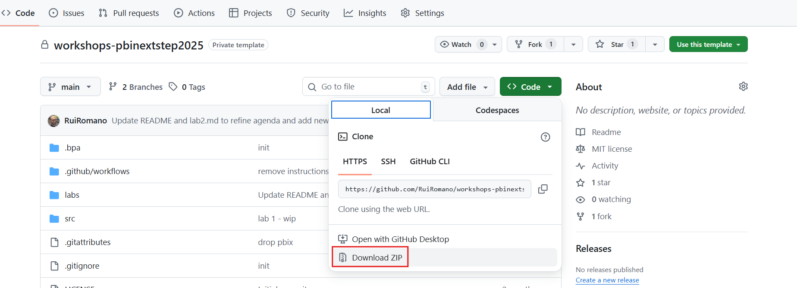

# Power BI for Developers: PBIP and CI/CD Unleashed

Hands-on deep dive into Power BI developer mode and the powerful capabilities unlocked by Power BI Project files (PBIP). In this session, you’ll explore TMDL and PBIR file formats, learning how they open the door to structured, source-controlled development workflows.

By the end of this workshop, you will:
- Gain a solid understanding of Power BI Project file formats (PBIP, TMDL, PBIR) and how they support modern, scalable development workflows.
- Learn how to effectively leverage AI to accelerate and enhance Power BI development, with hands-on, practical examples.
- Understand the value of applying DevOps and CI/CD practices to Power BI projects and walk away with actionable solutions—both out-of-the-box and community-driven.

## Get started

- Clone or download this repository to your machine.
  
- Ensure you met all the [Requirements](#requirements) before starting the labs.
- Open the lab documents in your browser for an improved reading experience.

## Agenda

| Topic                                    | Content                                                                                                    | Labs                                                              | Time          |
| ---------------------------------------- | ---------------------------------------------------------------------------------------------------------- | ----------------------------------------------------------------- | ------------- |
| **Power BI Project (PBIP) fundamentals** | • PBIP fundamentals • Git basics • Semantic Modeling as code with TMDL • Report as code with PBIR | [Lab 1 - Power BI Project (PBIP) fundamentals](.labs/lab1/lab.md) | 9:00 - 11:30  |
| **Power BI & CI/CD**                     | • GitHub Collaboration Workflows • CI/CD Pipelines                                                      | [Lab 2 - Power BI & CI/CD](.labs/lab2/lab.md)                     | 11:30 - 14:30 |
| **Power BI Development with AI**         | • Power BI Development with AI  • Agentic development                                                   | [Lab 3 - Power BI Development with AI](.labs/lab3/lab.md)         | 14:30 - 17:00 |

## Requirements

- Licenses
  - Access to a Fabric / Power BI tenant
    - You can use your existing organizational tenant but you must have admin permissions.
    - Power BI Pro license
    - Access to a Fabric Capacity or [Trial](https://learn.microsoft.com/en-us/fabric/fundamentals/fabric-trial)
    - An existing service principal (with `client_id` and `client_secret`) in your Azure tenant or the [permission to create new Entra Application](https://learn.microsoft.com/entra/identity/role-based-access-control/delegate-app-roles) - to be used for CI/CD setup.
    - We can provide a demo account for you if you dont have access to above.  
  - [GitHub account](https://github.com/signup)
  - [GitHub Copilot Pro](https://github.com/github-copilot/pro) [_Optional_]
- Software
  - [Power BI Desktop](https://pbi.onl/download)
  - [Visual Studio Code](https://code.visualstudio.com/download)
  - [Git for Windows](https://gitforwindows.org/)   
  - [Python 3.12](https://www.python.org/downloads/release/python-3120/)

## FAQ

**Q: I don't have access to Power BI license and / or Fabric Capacity.**

**A:** Ask the workshop instructors for a demo account.

**Q: I need a Credit Card for GitHub Copilot Pro Trial**

**A:** Yes. Is mainly to prevent abuse. You can sign-up and cancel after the workshop to avoid any charges.
