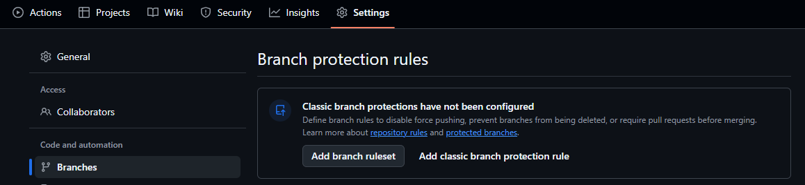
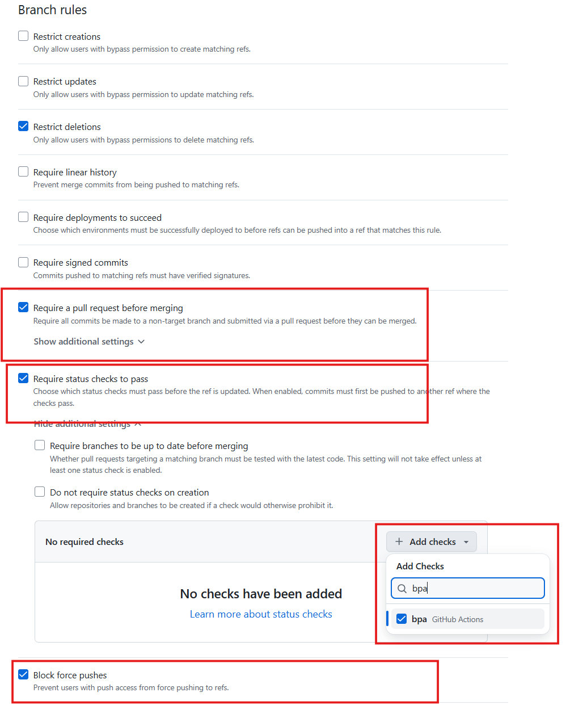
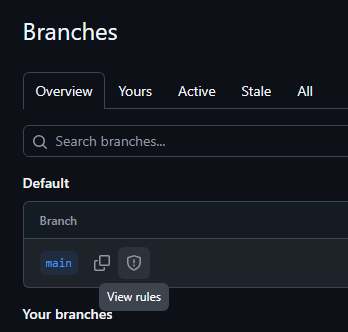

# Appendix: Branch protection setup

> [!NOTE]
> **Advanced / Optional** — This is a one-time administrative setup step. See [About rulesets](https://docs.github.com/en/repositories/configuring-branches-and-merges-in-your-repository/managing-rulesets/about-rulesets) for more information.

**Goal**: Protect the `main` branch so that changes can only land through a reviewed and quality-checked Pull Request.

## Set up branch protection rules

Since any push to `main` triggers an automated deployment to production, it is critical to protect this branch. With branch protection enabled, changes can only reach `main` through a **Pull Request**, which triggers the BPA quality checks first.

1. In your GitHub repository, navigate to **Settings > Branches** and click **Add branch ruleset**.

    

2. Provide a name for the ruleset (e.g., "Protect main") and under **Targets**, select **Default branch**.

    

3. Enable the rules shown below. Under **Require status checks to pass**

    

4. Save the ruleset. The `main` branch now shows a protected icon in the **Branches** overview.

    

> [!IMPORTANT]
> By requiring the **bpa** status check to pass, Pull Requests with BPA **Error**-level violations cannot be merged. This enforces quality standards automatically — no manual review needed to catch common issues.