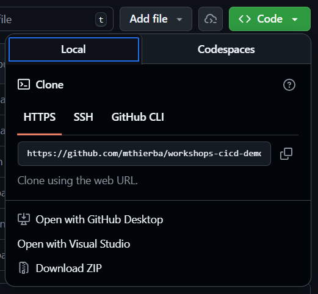
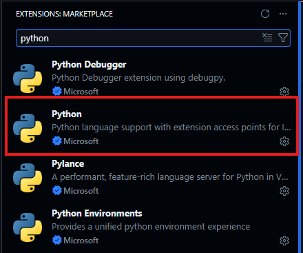
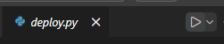
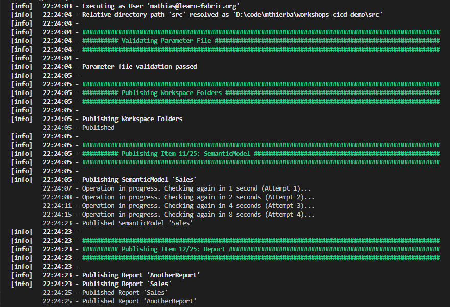

# Appendix: Local Deployment

> This appendix walks through running `fabric-cicd` deployments from your local machine. The main lab uses GitHub Actions for all deployments — follow these steps only if you want to test deployments locally before pushing to CI/CD.

## Prerequisites

### Clone the repository to your machine

1. On your repository's page, click the green **Code** button and copy the HTTPS URL.

    

2. Open a terminal and clone the repository:

    ```bash
    git clone https://github.com/<YOUR-USER>/<YOUR-REPO>.git
    ```

3. Change into the repository directory and open it in **Visual Studio Code**:

    ```bash
    cd <YOUR-REPO>
    code .
    ```

### Set up the Python extension in VS Code

The deployment script requires **Python 3.13**. The easiest way to manage Python versions and run scripts in VS Code is through the official **Python extension**.

1. Open the **Extensions** panel (`Ctrl+Shift+X`) and search for **Python**. Install the extension published by **Microsoft** if it is not already installed.

    

2. After installation, the extension automatically detects all Python versions available on your system. You can see the currently selected interpreter in the **VS Code status bar** (bottom-right) whenever a `.py` file is open (for instance, `scripts/deploy.py`).    

3. Click the Python version in the status bar (or press `Ctrl+Shift+P` and type **Python: Select Interpreter**) to open the interpreter picker. Select **Python 3.13.x** from the list.    

> [!TIP]
> If you have multiple Python versions installed (e.g., 3.10, 3.11, 3.12, 3.13), the Python extension makes it easy to switch between them. The selected interpreter applies to the integrated terminal and any scripts you run from VS Code — no need to manage `PATH` or virtual environments manually.

### A note on PowerShell

The repository includes BPA (Best Practice Analyzer) scripts written in **PowerShell**. These run automatically in GitHub Actions, but if you want to run them locally you need PowerShell installed on your machine.

- **Windows**: PowerShell is built in — no action needed.
- **macOS / Linux**: Install PowerShell by following the [official installation guide](https://learn.microsoft.com/en-us/powershell/scripting/install/installing-powershell).

## Understanding `scripts/deploy.py`

Open `scripts/deploy.py` in VS Code and take a moment to read through it. The script accepts three command-line arguments:

| Argument | Purpose |
| --- | --- |
| `--workspace_name` | Target Fabric workspace name. If omitted, the script resolves it from configuration files (see below). |
| `--environment` | An environment label (`DEV` or `PRD`). Used by `fabric-cicd` to apply the correct values from `parameter.yml`. Defaults to `DEV`. |
| `--spn-auth` | When `True`, authenticates via the Azure CLI session (service principal — used in GitHub Actions). When `False` (default), opens a **browser window for interactive login** — this is what you use locally. |

## Configuration files: `deploy.config` vs `.env`

The script resolves the target workspace name in this order of priority:

| Priority | Source | Committed to Git? | Purpose |
| --- | --- | --- | --- |
| 1 | `--workspace_name` CLI argument | n/a | Explicit override for one-off runs |
| 2 | `.env` file in the repository root | **No** (listed in `.gitignore`) | Personal overrides for local development — optional |
| 3 | `scripts/deploy.config` | **Yes** | Shared workspace configuration used by CI/CD and the team |

In practice:

- **`scripts/deploy.config`** is the main configuration file. It is committed to the repository and used by GitHub Actions. Edit this file to set the workspace names that the team and CI/CD pipeline should use.
- **`.env`** (in the repository root) is an optional file for local overrides. It is listed in `.gitignore` and never pushed to GitHub. If you need to deploy to a personal workspace that differs from the team default, create a `.env` file rather than editing `deploy.config`.

Both files use the same format — one variable per line:

```ini
PBI_WORKSPACE_PRD=Workshop - Lab 2
PBI_WORKSPACE_DEV=Workshop - Lab 2 (DEV)
```

## Install Python dependencies

Open the integrated terminal in VS Code (`Ctrl + '`). Verify that the terminal is using **Python 3.13** — check the status bar at the bottom or run `python --version`.

Then install the required packages:

```bash
pip install -r requirements.txt
```

This installs `fabric-cicd` and `python-dotenv` as well as any other transient dependencies into your active Python environment.

> [!TIP]
> If you have multiple Python versions installed and the `pip` command above installs packages into the wrong environment, use the following alternative to target a specific interpreter:
>
> ```bash
> python -m pip install -r requirements.txt
> ```
>
> Or, if you need to target Python 3.13 explicitly by its full path (common on Windows where multiple Python runtimes are installed side-by-side), use:
>
> ```bash
> # Windows example
> C:\Users\<YourUser>\AppData\Local\Programs\Python\Python313\python.exe -m pip install -r requirements.txt
>
> ```
>
> `fabric-cicd` requires **Python 3.13**, so make sure the interpreter you use is 3.13.

> [!TIP]
> If you have multiple Python versions installed and want to avoid confusion, consider using a virtual environment for this project. The Python extension in VS Code can automatically create and manage **virtual environments** for you. Learn more in the [VS Code Python documentation](https://code.visualstudio.com/docs/python/environments).

## Run your first local deployment

There are two ways to run the deployment script. The recommended approach for this workshop uses the VS Code Python Extension; the command-line alternative is listed at the end.

### Option A: Using the VS Code Extension

1. Make sure **Python 3.13** is selected in the status bar (see above).

2. Open the `deploy.py` script in VS Code.

3. Select the **Run Python File** play button in the top-right corner of the editor:

    

    The Python extension launches a new terminal and runs the script.
    The script reads your workspace name from `deploy.config` (or `.env` if present) and starts the deployment.
    Since you cannot specify any command-line arguments from the VS Code run button, it defaults to the `DEV` environment.

4. A **browser window** will open asking you to sign in with your Microsoft account. This is the interactive authentication flow — it is only used for local runs, not in CI/CD.

5. After sign-in, `fabric-cicd` publishes the items to your workspace. You should see output indicating each semantic model and report being deployed.

    

6. Once the script completes, open your **DEV** workspace in the Fabric portal and verify that the *Sales* semantic model and reports have appeared.

### Option B: Command line (advanced)

If you prefer working directly on the command-line, open any terminal (for instance, the one included in VS Code), navigate to the repository root, and run:

```bash
python scripts/deploy.py --environment DEV
```

You can also override the workspace name directly:

```bash
python scripts/deploy.py --workspace_name "My Custom Workspace"
```

The advantage of this approach is that you can specify command-line arguments, but the VS Code method is more streamlined for local development and testing.


## Data refresh after first deployment

After the **first** deployment to a workspace, the report visuals will not load because the semantic model has no data yet. `fabric-cicd` deploys only **definitions** (metadata), not data.

To load data:

1. In the Fabric portal, navigate to your deployed semantic model's **Settings** and take over ownership from the deployment principal.
2. Under **Data Source Credentials**, configure the `Web` data source with **Anonymous** authentication.
3. Trigger a **manual refresh**.

> [!IMPORTANT]
> This one-time setup is only needed after the **first** deployment to a workspace. Subsequent deployments will not require re-configuring credentials or triggering a manual refresh.

## Running BPA locally (optional)

If you have **PowerShell** installed, you can run BPA on your machine before pushing changes:

```powershell
.\scripts\bpa\bpa.ps1 -src @("./src/*.SemanticModel")
.\scripts\bpa\bpa.ps1 -src @("./src/*.Report")
```

This is useful for catching issues early, before they reach a Pull Request.
