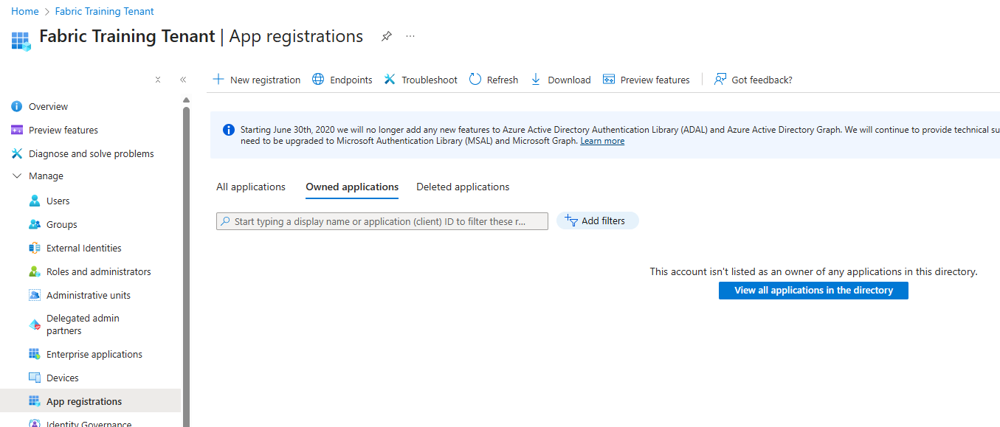
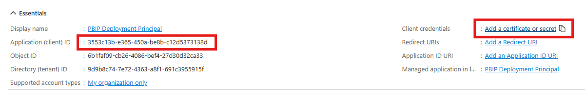
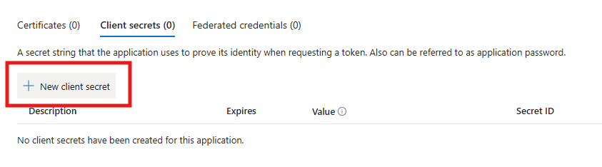
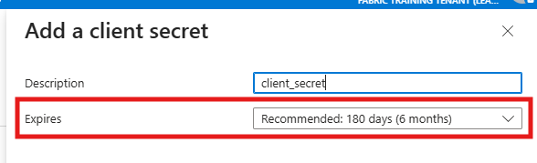
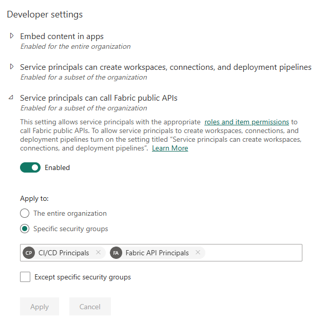
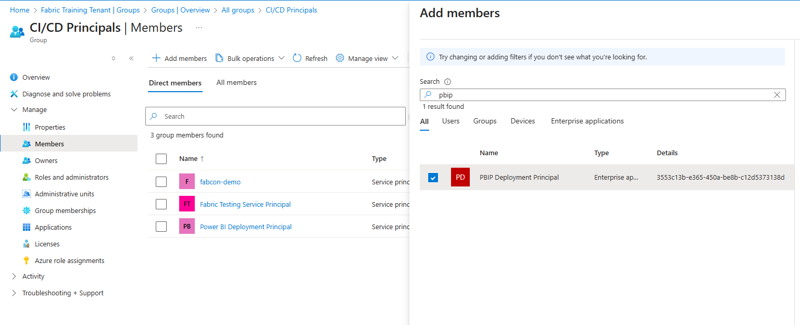

# Appendix: Service Principal Setup

> This appendix walks through the one-time setup of a service principal in Microsoft Entra ID. If your workshop environment already has a service principal provisioned, you can skip this section.

## Create an App Registration in Entra ID

1. In the Azure portal, navigate to **Entra ID > App registrations > New registration** ([shortcut](https://portal.azure.com/#view/Microsoft_AAD_RegisteredApps/CreateApplicationBlade/quickStartType~/null/isMSAApp~/false)).

    

2. Enter a recognizable name (for instance, "Power BI Deployment Principal") and keep **Single tenant** selected. Confirm.

3. On the application details page, take note of the **Application (client) ID** and the **Directory (tenant) ID**. Then click **Add a certificate or secret**.

    

4. Under **Client secrets**, click **New client secret**.

    

> [!IMPORTANT]
> The secret value is only shown **once**. Copy and store it safely immediately.

5. Select an appropriate expiration period and confirm.

    

> [!WARNING]
> Client secrets **expire**. Note the expiration date and plan to rotate the secret before it runs out. When a secret expires, all deployments using it will fail. You can create a new secret at any time — multiple secrets can coexist during a rotation period.

- Reference: [Register an application in Microsoft Entra ID](https://learn.microsoft.com/en-us/entra/identity-platform/quickstart-register-app)

## Authorize the Service Principal to use Fabric APIs

The service principal must be authorized to call Fabric public APIs. This setting is managed in the **Fabric Admin portal** (not in Entra ID or Azure):

1. Navigate to **Fabric Admin portal > Tenant settings**.
2. Enable **"Service principals can call Fabric public APIs"**.
3. Restrict the setting to a specific security group for better control.

    

4. Add your service principal to the authorized security group.

    

> [!TIP]
> In a production tenant, always restrict API access to a security group rather than enabling it globally. This limits the blast radius if a service principal is compromised.

## Add the Service Principal to your Fabric workspaces

The service principal needs **Contributor** (or higher) permissions on each workspace it deploys to. For this lab, add it to both your **DEV** and **PRD** workspaces:

1. Open the workspace in the Fabric portal.
2. Go to **Manage access** and add the service principal with the **Contributor** role.

    

Repeat for each workspace.
